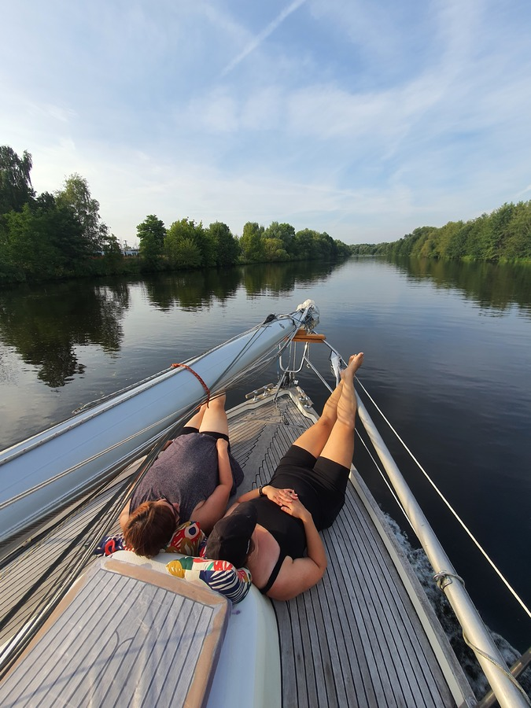

We started the trip after work from SC Gothia at 15:15 with the customary horn signals.
First stop was the Marina Lanke fuel dock to fill up the tank (52.6l). After some queuing, we left the station at 15:50 bound for the Spandau locks.
We cleared Spandau locks at 17:20, and headed north with the intention to overnight at lake Lehnitz.

 

At 18:40 the engine suddenly stopped and didn't start again. We were able to tie the boat to a piling meant for cargo ships on the side of the canal.
We tried various things to fix the engine, including pumping the feed pump manually and bleeding the primary filter. No help.

* Distance today: 9.8NM
* Trip distance: 9.8NM
* Engine hours: 2
* Lunch: Risotto at Gothia mess hall
