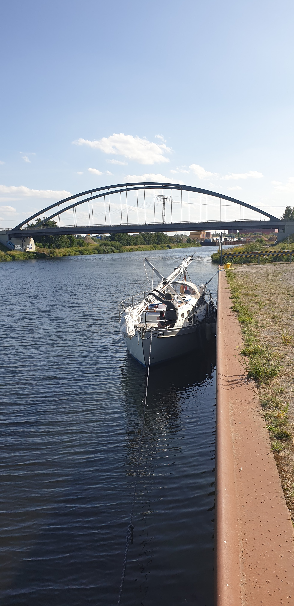

Berndt from the club arrived early in the morning with his motorboat carrying some spare parts and cold beverages. We did some additional motor debugging, but this time it started without issues.
A mechanic was contacted, and we agreed that he could arrive the next day to help us in Töplitz if we first get the boat there.
At 12:25 we started south towards Havelkanal to bypass Berlin.
We arrived to the Schönewalde locks at 13:25. We had to wait for a barge to go through (and almost smash the sport boat waiting pier). We were through the locks at 14:25.
At 15:55 the engine died again. A strong wind was pushing us towards the rocky side of the canal, and we dropped anchor to prevent this. Then we dug out our dinghy paddles, and turned the boat around with those. There was a docking wall slightly downwind, and we paddled the boat towards it. After a while, a small rubber boat with motor approached and towed us to the target. We tied securely.
Berndt arrived again in the evening to inspect the situation and bring us a new diesel pump, this time with a car, as we were only 20 minutes drive from Gothia. The mechanic was arranged to arrive the next morning.

 

* Distance today: 12.8NM
* Trip distance: 22.6NM
* Engine hours: 2.4
* Lunch: Spaghetti aglio olio
