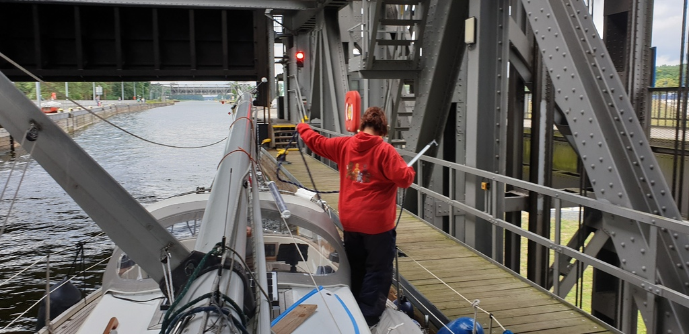
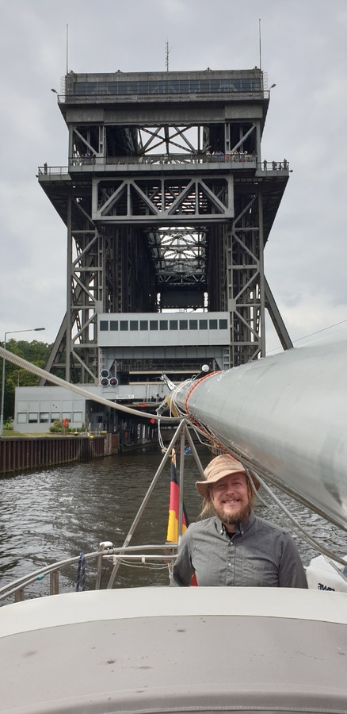

We finally started the engine and headed out of the Marienwerder harbour at 9:58.
There were major canal dredging works on the way, causing some stress with the works vehicles driving in erratic fashion despite it being a one-way traffic zone. We potentially touched bottom when evading one of them.

 

At 12:48 we arrived at the Niederfinow ship elevator. What a machine! At 13:33 we were through it.

 

Since it was Thursday, we had the traditional Finnish lunch of pea soup and pancakes.
After some look at the charts, we determined most harbours down on the West Oder to be too shallow for our boat, and hence decided to stop the day early and park in the Oderberg marina at 14:45.
In this marina sailboats sit snugly in soft mud.
No motor issues the whole day

* Distance today: 17.6NM
* Trip distance: 76.3NM
* Engine hours: 4
* Lunch: Pea soup & pancakes
