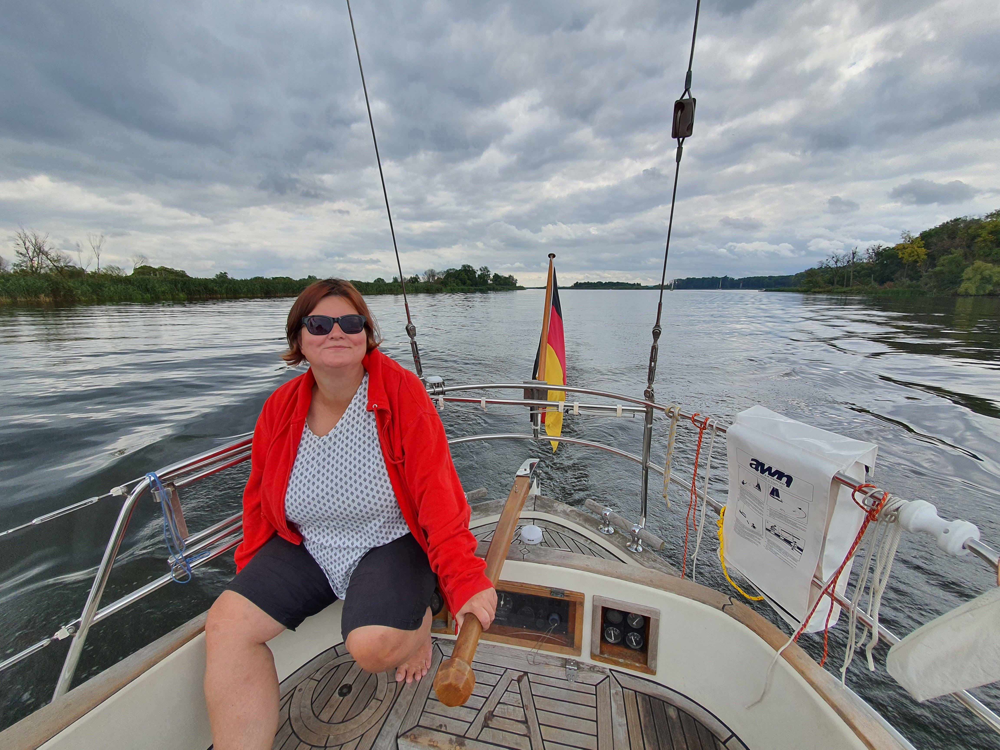
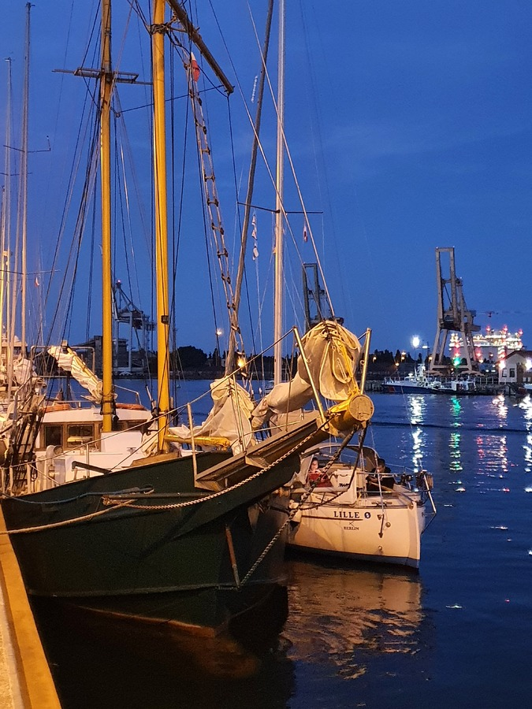

We moved the boat to the mast crane at 7:30, and by 8:20 the mast was up and we were able to start tuning the rig and preparing the sails.
This was also an opportunity to do some light provisioning, even though the grocery store was quite a walk away. We also utilized the local chandlery to get some spare parts for our navigational lights.
At 11:32 we left the marina and started crossing the shallow waters of the Dabie towards the sea.

 

At 13:38 we installed new waterproof connectors for the steaming and anchor lights. Pretty exciting to do electric work on deck whole under way.
We also installed the wiring and the NMEA 2000 connector for our new ultrasonic wind sensor.
Arrival to the Swinoujscie marina at 19:08. The marina was totally packed due to a harbour festival, and we ended up side-tying the boat to a Dutch steel schooner.

 

* Distance today: 29NM
* Trip distance: 153.3NM
* Engine hours: 6
* Lunch: Fried rice with aubergine
