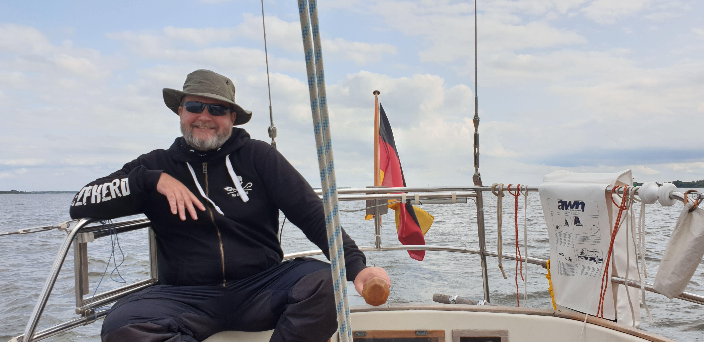

After a rolly night in the harbour, we went to check the fuel dock that had been closed the previous night. With some discussion with the fishermen on the pier, it became apparent that the fuel dock wasn't operational and the only way to refuel would be carrying jerrycans from a regular gas station some kilometer away.
Since we still had half tank left, we decided to press on.
At 8:35 we left the harbour, and by 9:10 we had sails up and were heading towards German waters with a nice force 4 from the beam. We were steering course 330.
Our general target was the Swedish south coast, but going there following the German islands of Usedom and Rugen so that we'd have plentiful safe harbours to tuck into on the way.
This was also an opportunity to test our tiller pilot, which had no problems steering despite the somewhat large swell on our starboard beam.

 

At 13:45 we received a mayday from a German sailboat that had run aground near Greifswalder Oie. We plotted a course and would've been there in about 25 minutes. The emergency was answered by MRCC Bremen, and we continued our way northwest.
Due to the swell buildup, we decided at 14:25 to head course for Sassnitz and overnight there.
At 16:18 we dropped the sails outside the Sassnitz harbour. Without their stabilizing effect this became a rollercoaster ride. Lesson learned: next time we'd drop sail inside the large wavebreak instead.
By 16:40 we were tied in one of the marina's ridiculously oversized boxes. We checked in with the marina office, and booked fresh bread for the next morning.
In the evening we dined in a nice Italian restaurant next to the marina and used the opportunity to do laundry.

* Distance today: 41NM
* Trip distance: 194.3NM
* Engine hours: 2.5
* Lunch: Coconut curry lentil soup
