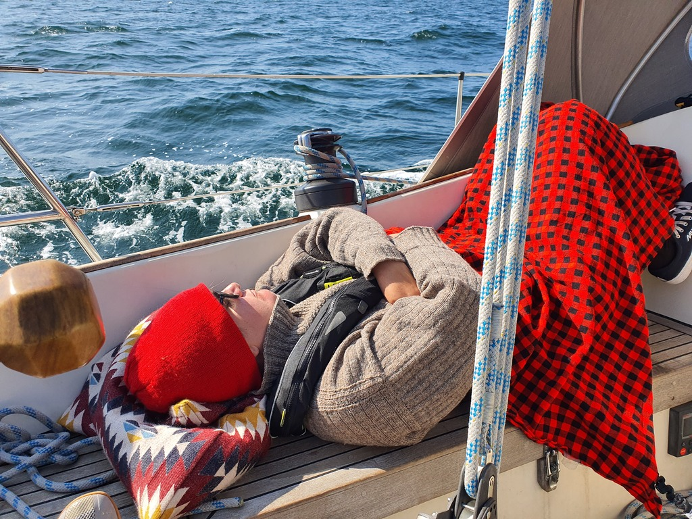
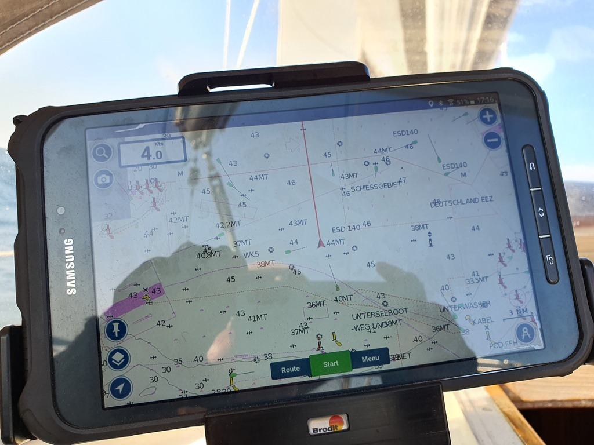

The night in the Sassnitz harbour was quite restless. The marina is large enough for a swell buildup inside.
Despite the night poorly slept, it was time to press on. The weather forecast was showing a storm coming over in two days. If we'd want a chance to sail, we should be in the lee of the Swedish south coast by then.
We went to the fuel dock at 10:14 after breakfast and some discussions. Karin and Daniel left the boat at this stage for their own adventures, so from now on, it'd be just the two of us. We filled up 40l at the gas station.
Having learned the lesson, we hoisted sails inside the harbour at 10:41. Then out on an easterly course to get a tack avoiding the white cliffs of Königstuhl.
At 11:50 we tacked north to 350 and enabled the tiller pilot. Now we'd start the 4h-on-4h-off watch system we use on passages.

 

At 13:05 we inspected a low voltage alarm from the tiller pilot. One unrelated issue found was that the cable connecting the starter battery to our battery isolator (and hence enabling charging of house batteries from the alternator) had become loose. Reconnected it and ran motor for a while to recharge.
At 16:00 wind picked up to 15kt
Crossing the main traffic lanes between Germany and Sweden went without a hitch. Having an AIS transponder was certainly a boon, as not only we could see all the traffic in our Navionics, they could also see us. We even saw a large cargo vessel make a course change to pass us more safely.

 

Land ahoy! We sighted the Swedish coastline at 19:13. First came internet, and then the sight of land.
By this time waves had reduced significantly, to maybe 0.4m height.
At 22:20 we turned course to east and Simrishamn. As the wind was dying we shook out the first reef. Soon the autopilot would be unable to steer due to the low boat speed. We continued ghosting along the Swedish coast.

 

We took a tack north again at 6:40 to avoid the Traffic Separation Scheme in front of Bornholm.

By 11:15 the wind had died completely, so it was time to drop sail and motor towards Simrishamn.
We arrived to the nearly-empty marina at 12:31 and tied up to one of the guest boxes. Harbour office wasn't open off-season, so the payment was handled via a web form which sent us the PIN to access marina facilities.

* Distance today: 95NM
* Trip distance: 289.3NM
* Engine hours: 1.2
* Dinner: Risotto with carrots and olives
* Breakfast: oatmeal porridge
