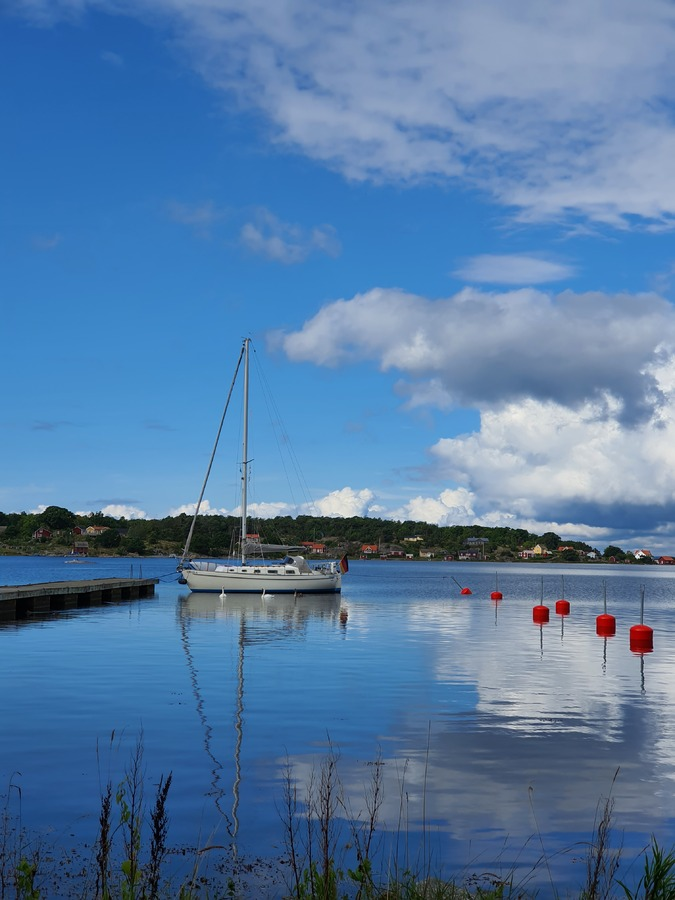

On our tour the previous day we had found out that the military shooting range outside of Simrishamn would be active on our departure day. Because of this we had an early start at 7:05, plotting the course so that we'd clear the range before it activates. At 7:15 we had sails up, and were sailing with a slight angle through the south-east corner of the range (course 030).
At 8:38 we were out of the shooting range and switched to a more northerly course to head towards the Blekinge archipelago.

 

At 10:22 we switched on the tiller pilot. By 11:35 the wind had reduced to 9.7kt, and we shook out the reef.
Around 13:35 the wind died, and we started motorsailing, keeping the main sail up to stabilize the boat in the still-existing swell. Our first time using the motorsailing daymark!
At 17:06 we were tied up at the pier in A. This is a free pier available for boats shorter than 40ft. You tie up to a buoy at the stern.

 

We removed some 15l of water from the bilge using an improvised bucket as the bilge pump had died.
Then to explore this Unesco world heritage nature site!

* Distance today: 41.5NM
* Trip distance: 330.8NM
* Engine hours: 3.5
* Lunch: Pea soup & pancakes
