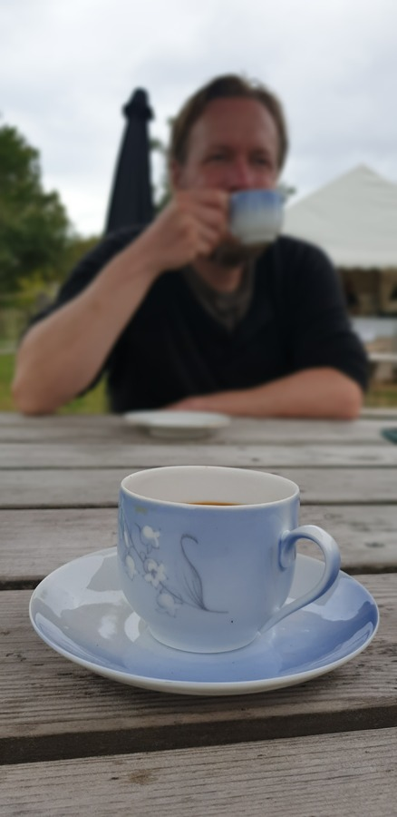

Internet information had led us to believe that the island would be deserted at this time of the year, but turned out the ferries still run, just on a reduced schedule.
We had a coffee and waffles break at a local cafe, and took some of the designated nature trails.
A lovely tea break on some skerries.
The level of Swedish infrastructure was quite visible. This island only has summer cottages, and yet they were installing fiber internet to all of them!

