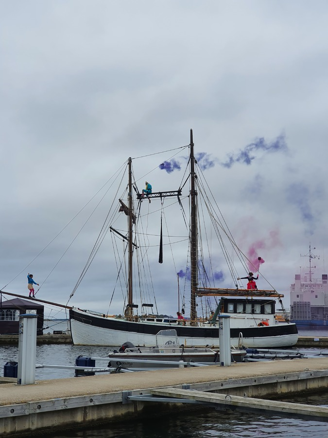

We left the pier at 8:37, and hoisted sail as soon as we were out of the narrow channel between the skerries.
Our propeller didn't feather automatically this time. We had to switch it on reverse for a moment to make it stop spinning and feather.
Tiller pilot was steering on an easterly course. We chose to navigate to Karlskrona south of the archipelago to have a clean course on the main shipping lane.
At 12:29 we arrived to the Karlskrona fairway, dropped sails and motored past the old fortresses guarding the harbour.

 

We tied up in the guest harbour at 13:53. Just like in Simrishamn, the marina office was closed and payment was with the GoMarina app.
Karlskrona guest harbour is a big one, with again space to build up some swell. Good services, with possibility to do laundry, and even a Swedish sauna in the shower facilities.
There was a circus show being performed in the rigging of an old wooden schooner, so we cracked open some beers and enjoyed it.

 

* Distance today: 27NM
* Trip distance: 357.8NM
* Engine hours: 1.8
* Lunch: Navy bean soup
