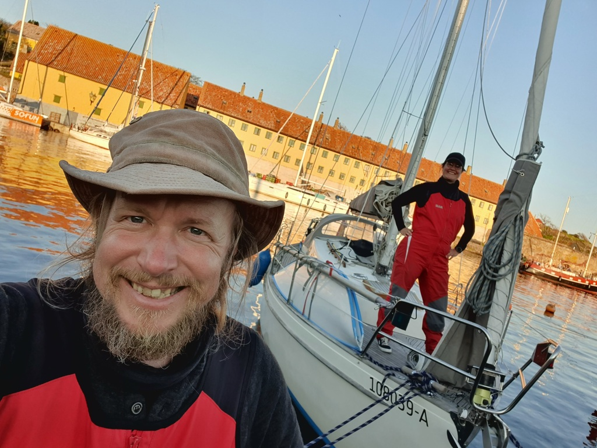

We left the Utklippan harbour at 8:10, and had the sails up just five minutes later.
Tiller pilot was set to a downwind course paralleling the main shipping lane, and we set a preventer to keep things safe.
At 9:00 our topping lift got tangled with the radar reflector on our port side main side stay. It took us 40 minutes (and cost one lost beanie) to clear it.
At 10:10 we gybed east to cross the shipping lane. By 10:50 the wind had died so we switched to motorsailing on 1st reef to clear the northbound lane. By 12:30 we were clear of the shipping lanes and were able to start sailing again towards Christiansoe. At 13:10 we reached Danish waters and switched the courtesy flag appropriately.
Around 15:52 the wind had died, so we dropped sail and started motoring towards the island fortress. We found out that our depth sounder maxes out at 90m.
We tied up at 18:50, stern with mooring buoy, at the west island. Just in time to still get dinner and beer at the local restaurant while enjoying a beautiful Baltic sunset.

 

Marina payment was with a machine at the harbourmaster's office

* Distance today: 46NM
* Trip distance: 416.8NM
* Engine hours: 4.3
* Lunch: Coconut curry lentil soup
