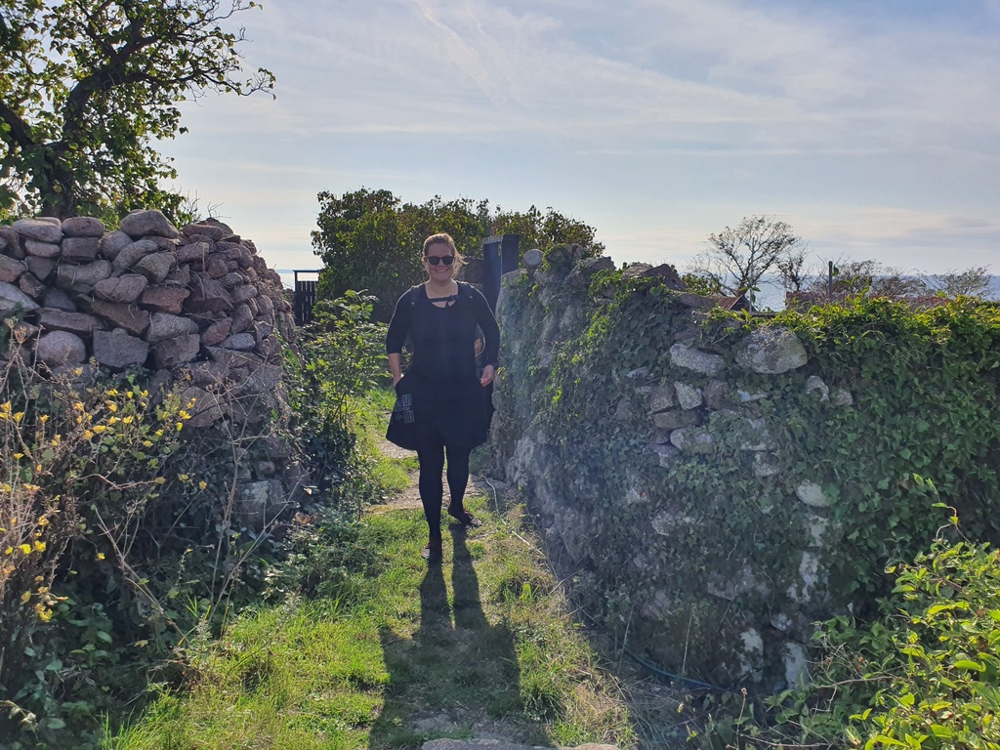

Christiansoe is a stunning fortress, and so we spent the day exploring the islands.
We found a small local brewery with lots of different exploratory beer varieties. Apparently the selection would be even better in the beginning of the season. Not cheap, but worth it! We also bought some local pickled herrings and did laundry.

