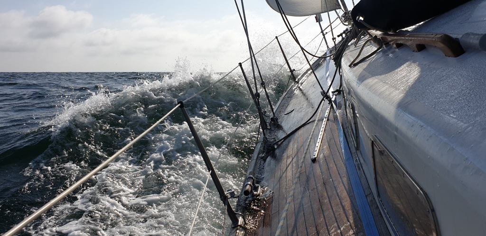

We started from Svaneke harbour at 11:10 to catch a favorable wind shift. At 11:20 we had sails up and were heading downwind along the east coast of Bornholm.
At 13:30, somehow past Nexoe the wind died. We motorsailed a bit to get out of the wind hole.

At 13:45 the wind shifted to westerly and started strengthening, so we resumed sailing.
We started the passage from Bornholm to Poland on a nice 15kt beam reach, but it would reduce, turn southerly and die overnight.

 

By 9:16 there was no wind left, and we had to drop sail and start motoring.
We arrived to Swinoujscie harbour at 12:20, this time finding plentiful free space. In this marina the reserved boxes are marked with a red sign. Unmarked boxes are free.
We paid for the marina at the harbourmaster's office, had lunch in the tavern, and went to town for ice cream and provisions.

* Distance today: 98NM
* Trip distance: 527.8NM
* Engine hours: 3.4
* Dinner: Asparagus risotto
* Breakfast: Oatmeal bluebery porridge
