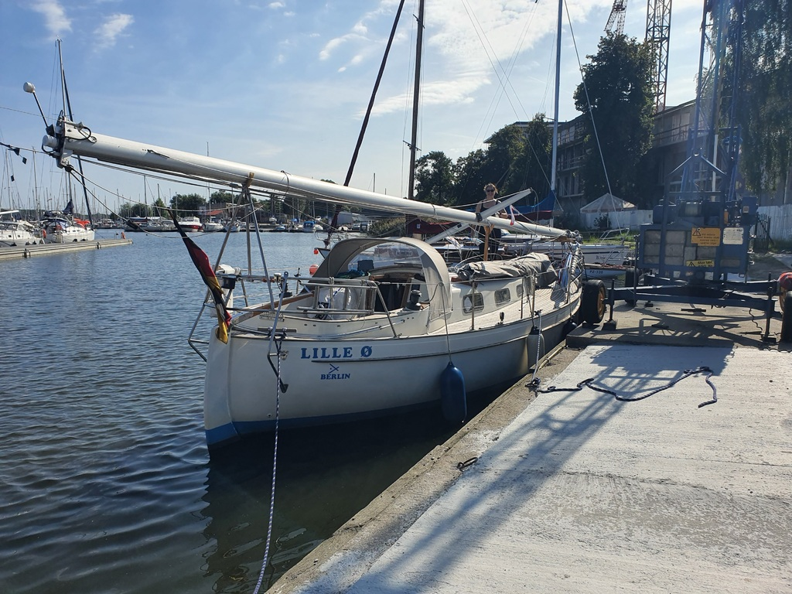

We dropped the mast in the morning with the help of the harbourmaster. Then it was time for some maintenance. The electric oil pump we had brought from Berlin let out the magic smoke, so we bought a manual one from the marina chandlery and changed the engine oil.
After some discussion with the harbour master, it was communicated that the local fuel dock is "no good", so we hauled 30l of diesel from a gas station some 15min walk away.

