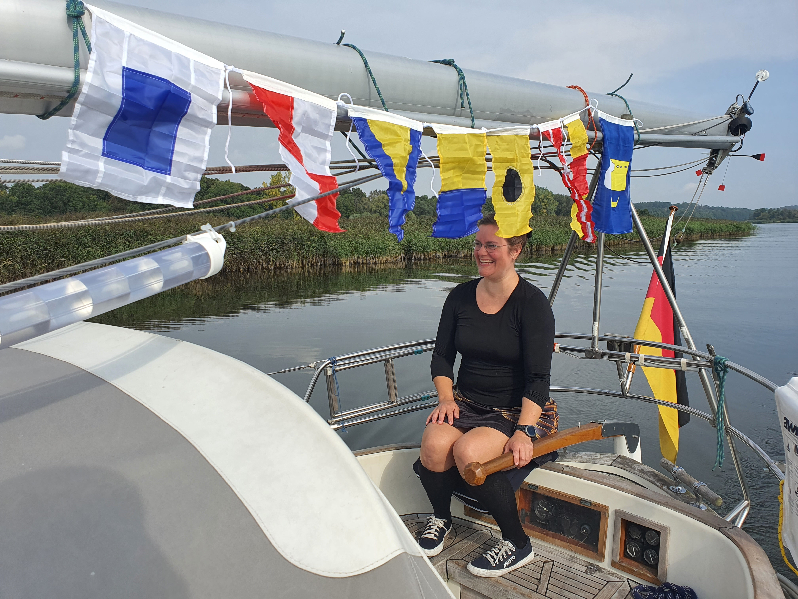

This was Susanna's birthday, so we hoisted the signal flags for "S-U-S-K-I-4-0".

 

We left the AZS marina at 7:30, sipping coffee while motoring along the misty river.
After an uneventful trip, we entered the Hohensaaten locks at 15:53 without having to wait by "tailgating" a freighter.
Tied up at the Oderberg marina at 16:59. It was time for some birthday sparkling wine!

* Distance today: 46.4NM
* Trip distance: 610.8NM
* Engine hours: 9.8
* Lunch: Shakshuka
