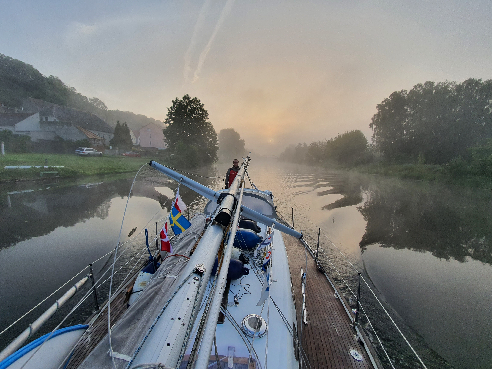
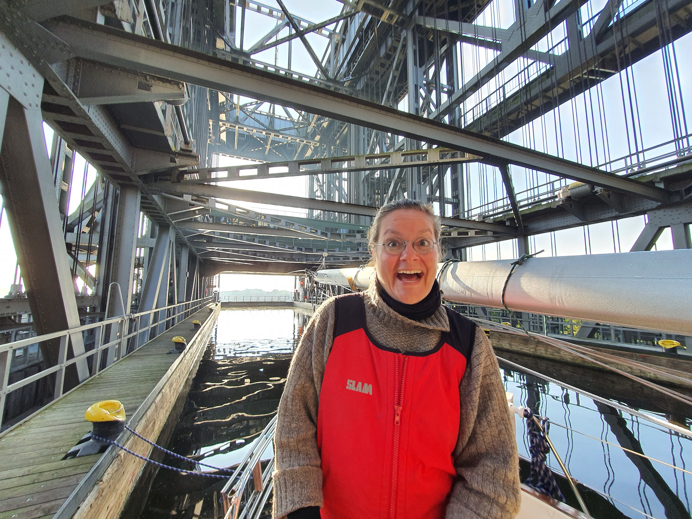
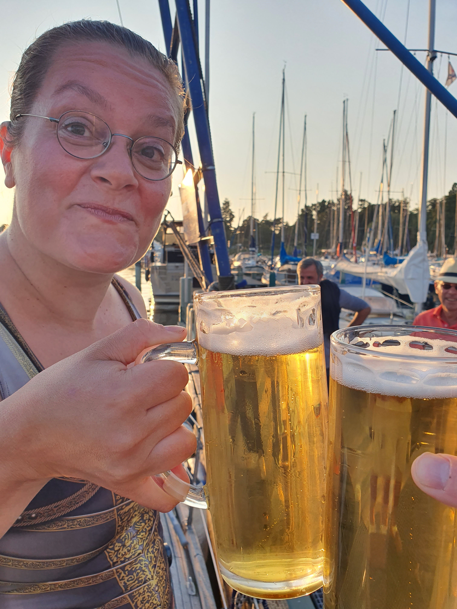

We left the Oderberg marina at 6:48, ghosting along the quiet river in a thick fog.

 

At 7:50 we arrived at the Niederfinow ship elevator. The fog had just started lifting in the morning sun. Coming in this early, we got a private elevator to ride with! 
 

At 8:40 we were out and motoring towards Berlin.
We passed the dredging works at 10:50. It was exciting as always, but less problematic than the last time.
At 13:55 we arrived to the Lehnitz locks. The waiting pier was full, and we ended up helping a chartered motorboat tie up alongside us. We had a long "boat buying chat" with them while waiting, and got a bottle of cold sparkling wine for our troubles. At 14:20 we were out of the locks and on the Lehnitz lake.
We arrived at the Spandau locks at 17:10, and had a very long wait. Maybe the lock keeper had a lunch break? In any case, we motored out at 18:04.
Arrived back to Gothia at 18:45. Berndt was waiting at the end of the pier with a tray full of cold beer. Good to be back home!

 

* Distance today: 56NM
* Trip distance: 666.8NM
* Engine hours: 10
* Lunch: Spaghetti Bolognese
