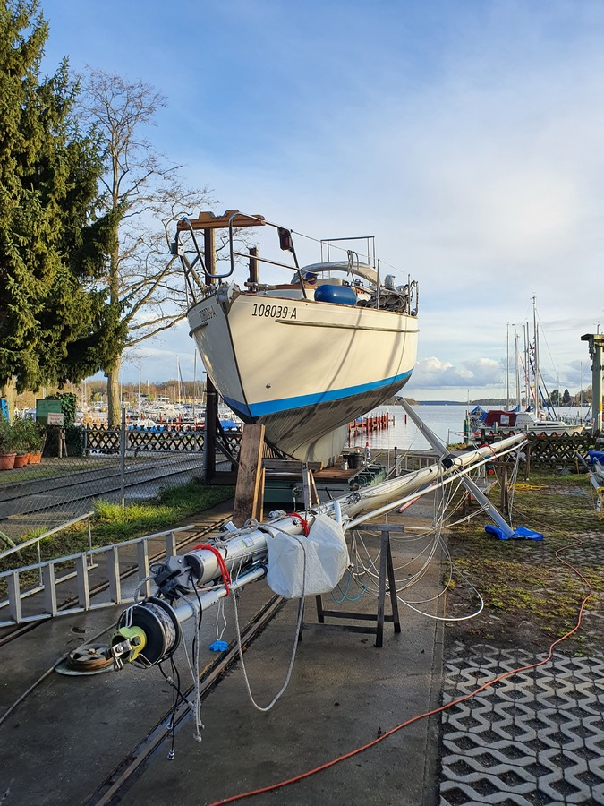

Lille Ø was lifted to the hard for the weekend in preparation for this summer's cruise. A hectic weekend followed, with a full winter's workload compressed into just a few days.

 

The TODO list:

Wash boat\
Wax boat\
New antifouling\
Wash mast\
Lubricate mast rollers\
Rigging check\
Replace broken mast sheave\
Install new jib halyard\
Re-route spi halyard\
Propeller maintenance\
Install solar arch\
Replace toilet sink seacock\
Check all seacocks\
Change all positional lights to warm white leds\
Check rudder attachments for wear and tear\
Profurl maintenance

There are still some smaller things to do that can be done in the water. And of course provisioning.

* Distance during weekend: 120 000 steps
* Elevation: 57 floors
* Feeling: exhausted
