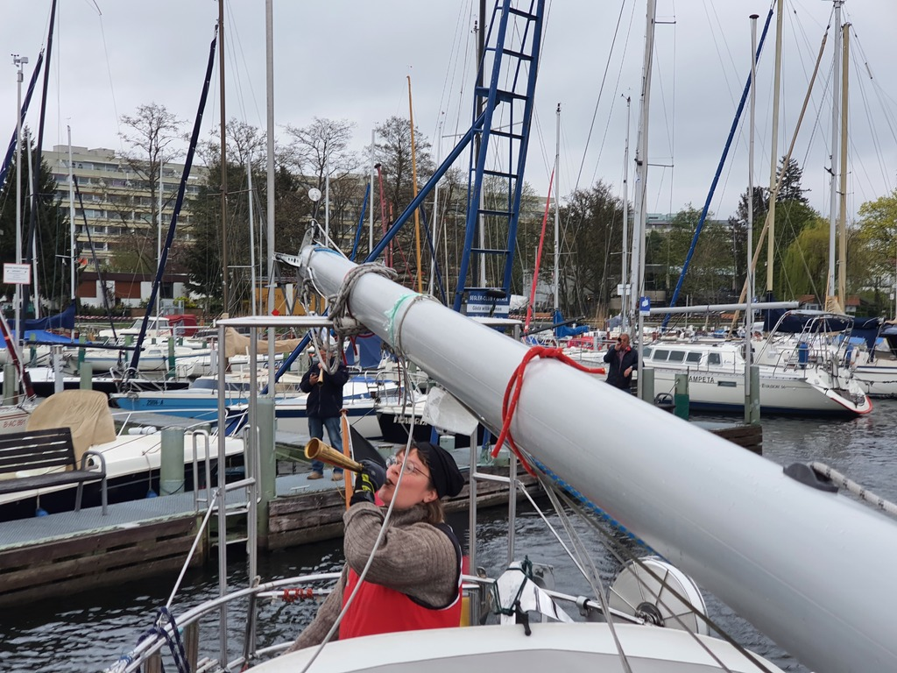
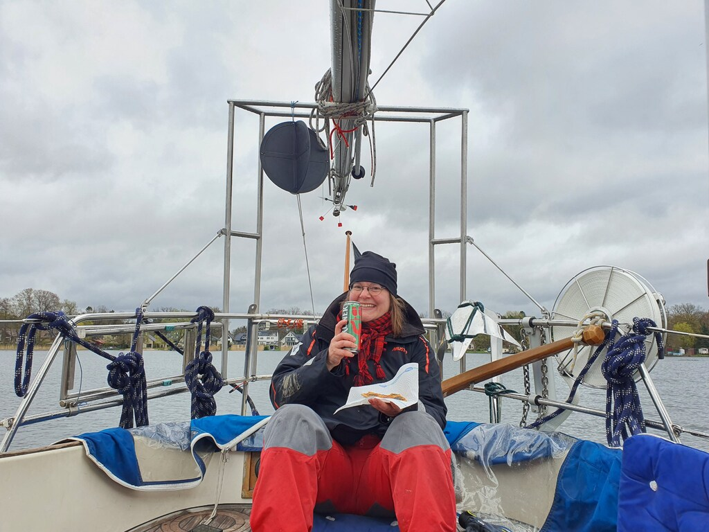

We started at 7:00 on a grey morning with the traditional horn blasts from our fellow Gothia members. The previous night we had already moved the boat to end of the pier to make provisioning easier.

 

We motored onwards to the first locks of the day: Spandau. After about half an hour of waiting we were in the locks alone, and quickly through. Then we motored through the quiet outskirts of Berlin towards north.

At 11:05 we arrived at the Lehnitz locks where there was already a motorboat waiting before us. The locks opened very soon, and up we went.

When motoring out the of the locks, the lock keeper announced that "by the way, you know the canal is blocked near Zerpenschleuse?" Oops.

Of course we had consulted the inshore navigational information service (Elwis) the day before the trip to see if there are problems on the way. But between then and our departure there had been an oil spill that blocked our way to the sea. The estimated channel reopening would be in four days, after the Easter holidays.

We consulted the chart, and called the harbour master of the marina near the blockage to see if we could wait there. But sadly their harbour wasn't deep enough for our 1.5m draft. So instead, we made an U-turn and went through the Lehnitz locks again. There is a small lake there, and we dropped anchor.

 

The plan is to wait here at anchor until the channel reopens. If that takes longer than anticipated, there is a marina on the northern shore where we can probably dinghy for provisions.

The adventure has begun!
