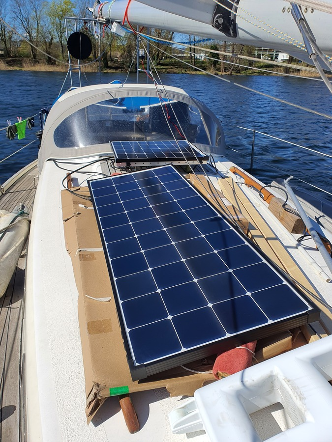
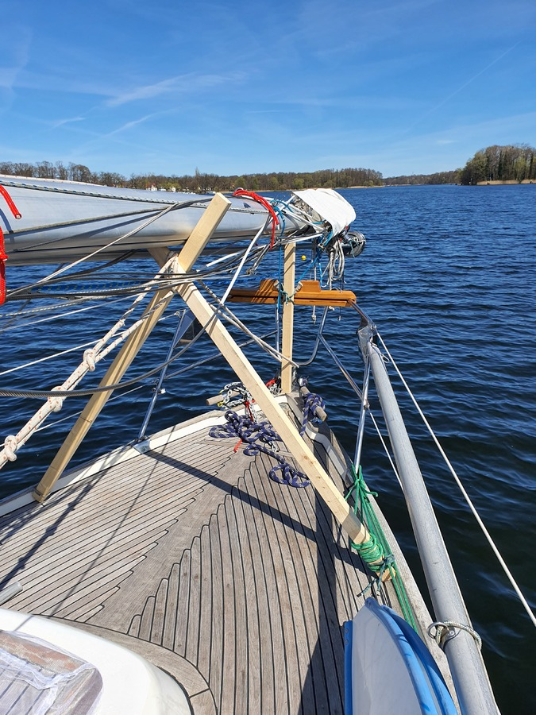

Being stuck here for the Easter, we enjoyed a lazy morning, topped with some coffee and cinnamon rolls in the noon sunshine.

To keep the boat powered up, we rigged our aft arch panel on the deck. Not ideal, but at least now we have 40% of our normal solar capacity usable. The rest will require the mast to be up. At 17:00, we had generated nearly 1kWh from the sun, meaning that we'll be finishing the day with roughly the same battery level we started it with.

 

We still had some projects left from the dry dock, and we spent the afternoon on those. We rigged a longer fender board for the locks, and built a new a-frame to keep the mast foot higher and hence nearer to horizontal. This should help with the low bridge we anticipate in Poland.

 

Since the potatoes in our bilge had started sprouting, we boiled the whole bunch. This meant lovely fried bracioles for today, and probably some potato salad tomorrow.

Now it is time to enjoy the evening sun and some beers.

* Distance today: 0NM
* Trip distance: 20.2NM
* Engine hours: 0
* Lunch: potato pecorino braciole with home-made honey dijon mayonnaise
