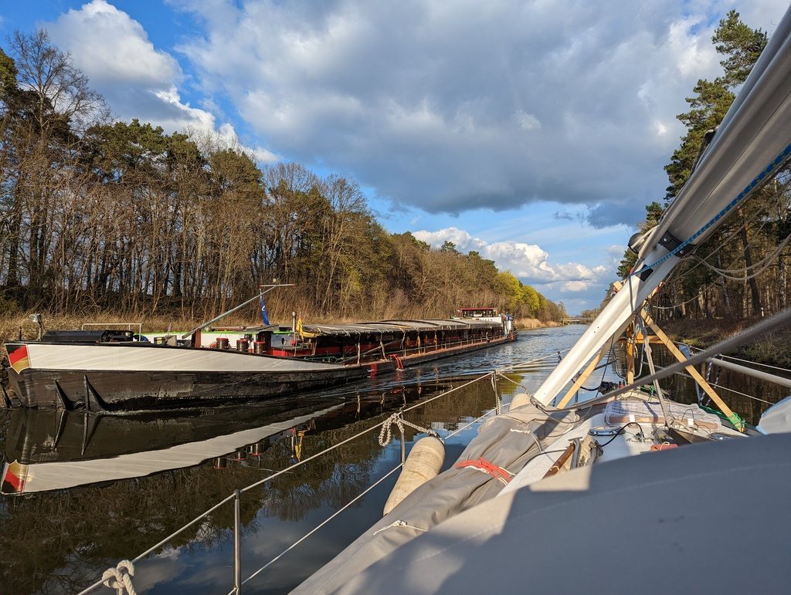

A early work morning to get an early end for the boat-office day. At noon the first check in elwis to see weather or not the canal is open again. The verdict was a 2 hour extension to the shutdown. Leaving a bit work to be done under way, we lifted the anchor at 14:40 and headed over to the locks.

At the Lehnitz locks we waited for an hour and were out on the high side at 15:55. I was promptly reminded, that in the German countryside the internet disappears as soon as you see the last house. So some good quality concentration time with code was achieved. 

 

There was a fair amount of traffic along the way. Arrived in Marienwerder at 18:40 and found a berth for us for 2 nights. 

* Distance today: 15.6 NM
* Trip distance: 35.8 NM
* Engine hours: 3.5
* Lunch: Tomato-olive pasta
