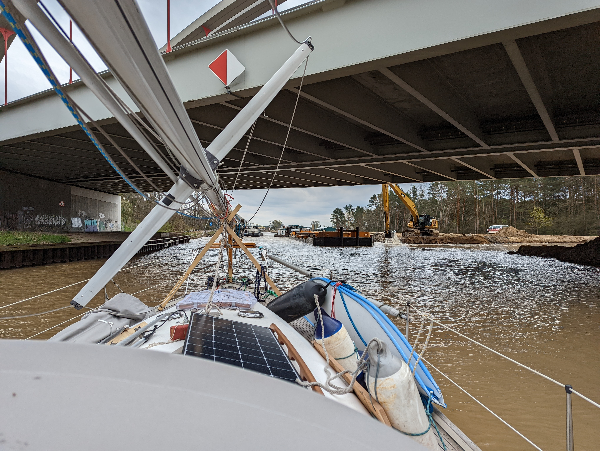
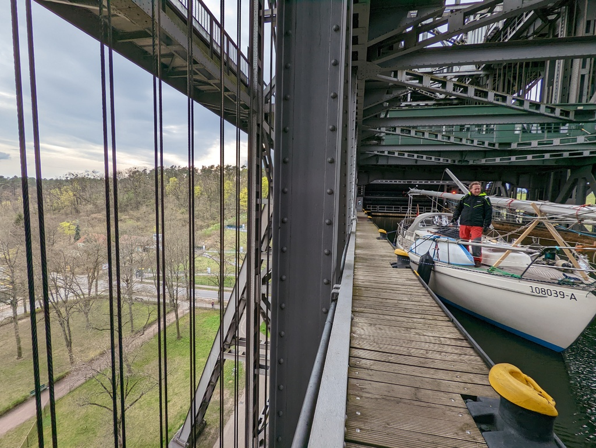
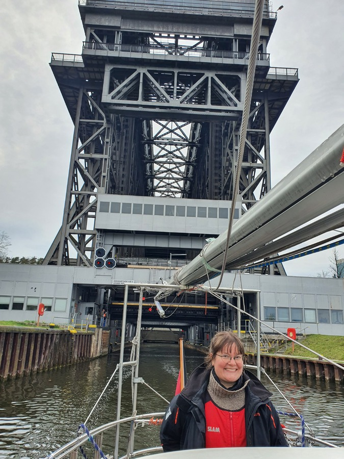

Another early workday, and after the last meeting under way. The stretch between Marienwerder and Eberswalde is still being widened, and the construction traffic makes this part quite hectic. Thankfully we now have a VHF that also works with the mast down, and hence could coordinate with the workboats. We even got a _"have a nice trip"_ from them in the end!

 

After that came the highlight of this canal tour, the Niederfinow ship elevator. This time we were lucky and got in without waiting, and were given a private lift ride down to the Order valley.

 

The biotope changes immediately, going from the sandy pine forests up to lush marshlands below.

 

There are very few places to stop for a vessel with our draft in the Oder valley, and hence we yet again tied to the familiar marina in Oderberg where our boat lies on a bed of soft mud.

* Distance today: 17.3 NM 
* Trip distance: 53.1 NM
* Engine hours: 3.9
* Lunch: pea soup  with dried tomatoes
