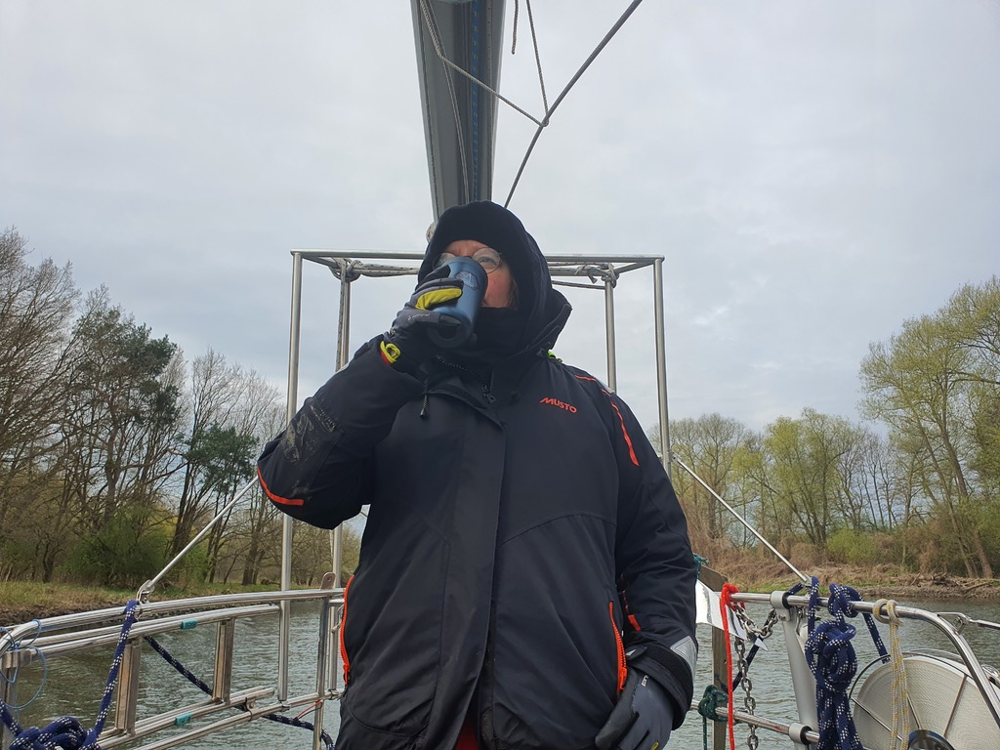

We started at 6:50 in the morning by removing the mooring lines and giving the boat a good shove off the pier to get out of the mud and into clear water before starting the engine.

At 7:30 we were at the last locks of this trip, and got promptly lowered near the sea level. A pleasant motoring down the stream along a nature reserve followed. We spotted beavers, falcons, and even a couple of eagles along the way.

 

We crossed into Poland at 13:30 and hoisted the appropriate courtesy flag.

When we finally reached the low bridge we've been dreading, it turned out to be closed for traffic. The imaginary beer mugs in the horizon disappeared in a puff of diesel smoke, and we plotted a "scenic route" that would take us through downtown Szczecin and it's busy commercial harbour. At least the bridges would be taller (lowest 3.4m instead of 3m)!

 

At 17:30, two hours later than anticipated, we side tied to an empty pier at the AZS Marina. The club is putting all of their boats into the water tomorrow, so we'll see when we get a spot at the mast crane. But at least we're in a place ships are ocean-going and sailboats have their masts up.

 

* Distance today: 54.3 NM
* Trip distance: 107.4 NM
* Engine hours: 10.3
* Lunch: Finnish macaroni casserole
