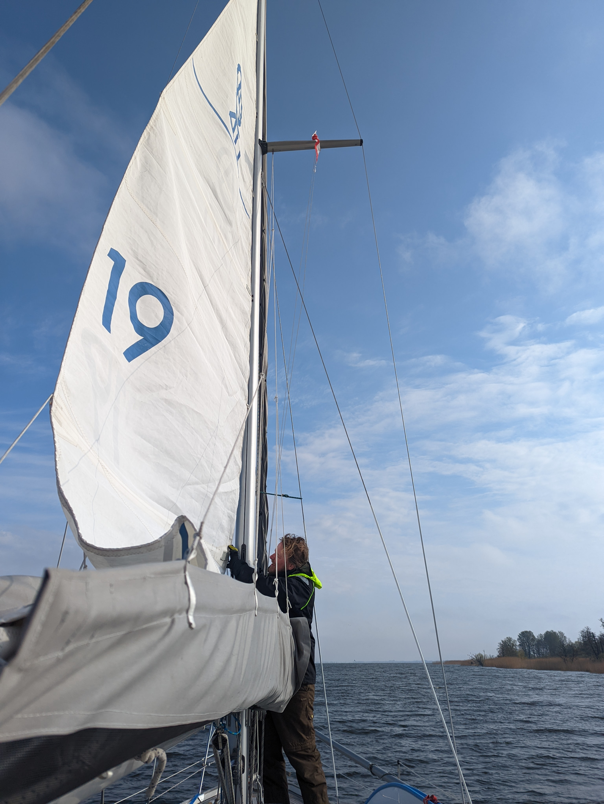
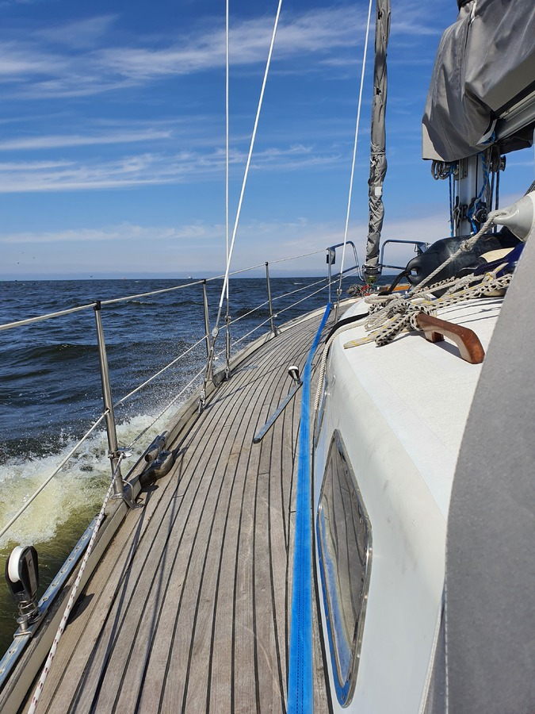
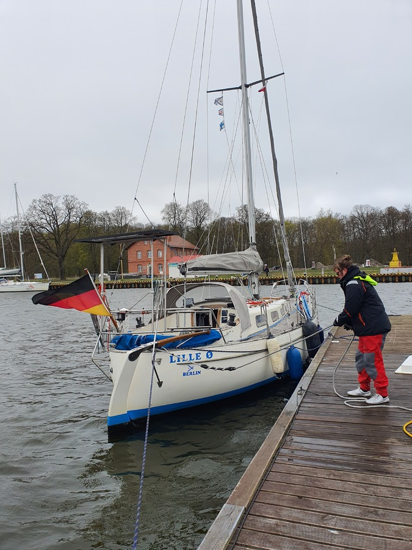

Another motoring day, as we wanted to reach the Baltic sea coast harbour of Swinoujscie before a forecasted gale.  We used the calm of lake Dabie to bend the sails so that if the wind actually wasn't on the nose, we could sail a bit. No such luck!

 

At the Szczecin lagoon we let our tiller pilot steer the boat, and enjoyed a lunch in relative calm. After that the waves started building up, and reducing our travel speed.

 

Some dodging of traffic and evading fishing nets followed. 

When we reached the canal leading into the Swinoujscie harbor, the gale caught up to us, both stronger and earlier than assumed. This mean progress quite slow and bumpy. At worst, we were only making 2.5kt over ground at full RPMs, less than half of what we'd normally do.

The Swinoujscie marina is pretty big, and open to exactly this wind direction. The season hasn't apparently quite started here, so they haven't even repaired the winter damage to the piers yet.

After a bit of wandering, we found an intact pier with couple of other boats in it. But making the turn through the wind to approach it proved difficult. Eventually we made it, and with some local help were able to pull the boat in to a proper side tie.

 

We plan to spend the work week here, do some smaller boat projects, and reprovision the boat before heading out to the Baltic proper.

* Distance today: 37.2NM
* Lunch: spaghetti with avocado sauce
