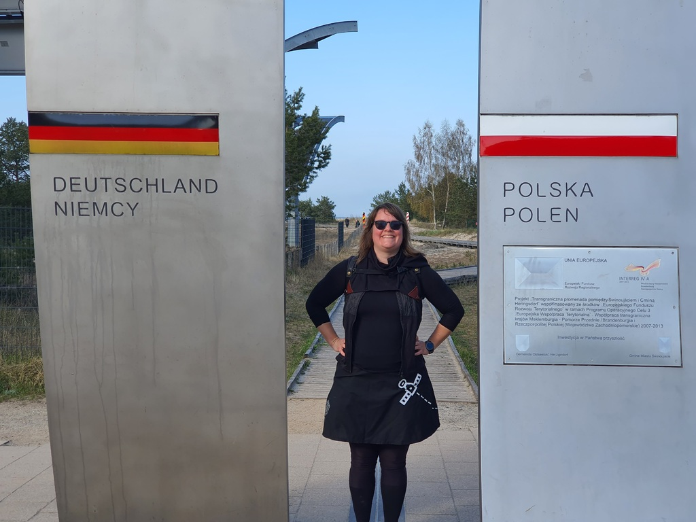
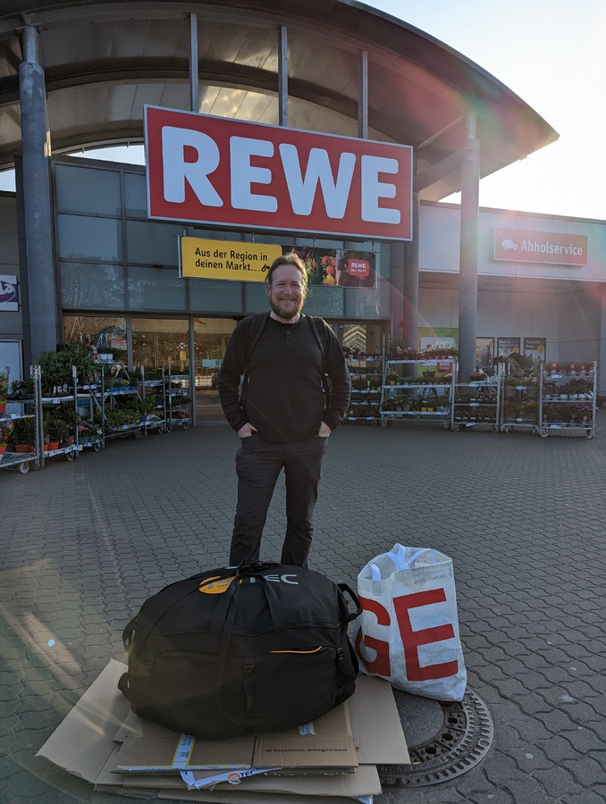

Baltic sea is known for its light summer winds. That's why we wanted a downwind sail to keep the boat moving. After a lot of reading and pondering we ordered a Parasailor from Istec. The ponderings took so much time that the delivery date for our made-to-measure sail was only one week before our intended departure date. As is with the current supply chain issues, the halyard for the sail got delayed. So we left  to on our adventure without the sail. As things happen, we also got delayed along the way.

Yesterday we got the news that the sail and the halyard were ready to ship. Some quick thinking lead us to realize that the island we are moored at is shared between Poland and Germany.

 

We contacted Istec and they agreed to express ship the sail to the nearest DHL location on the German side (thanks, Gerold!).

 

Now we have the sail, tomorrow we fetch the halyard. Can't wait to try the sail out! 

* Lunch: fresh rye sourdough bread
* Dinner: Pierogi with potato and cheese filling
* Steps: 30 000 and counting
* Feeling: excited
