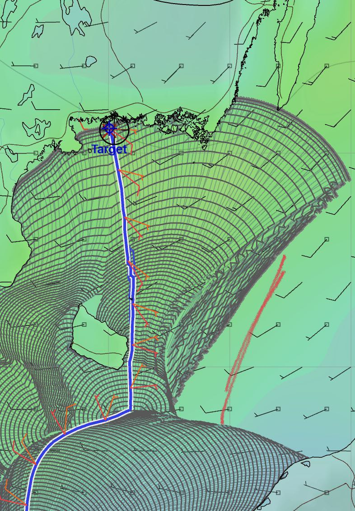
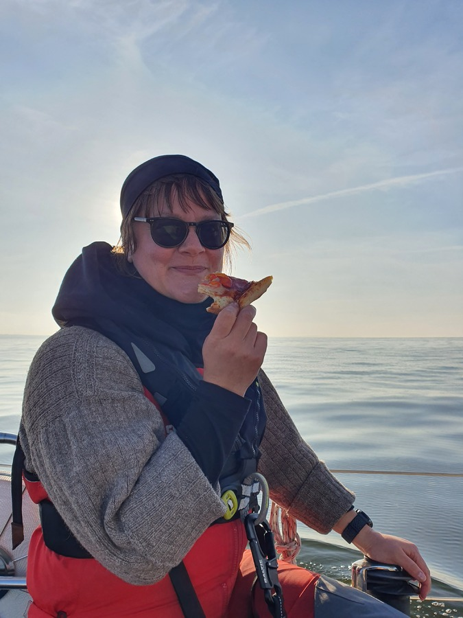
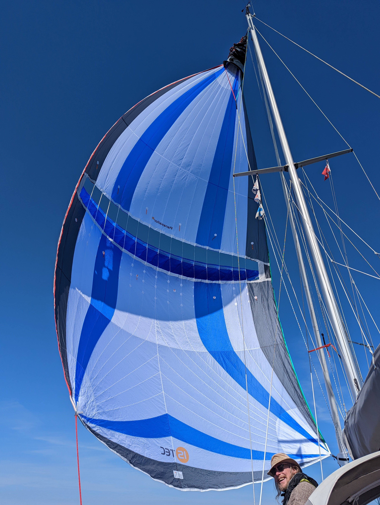
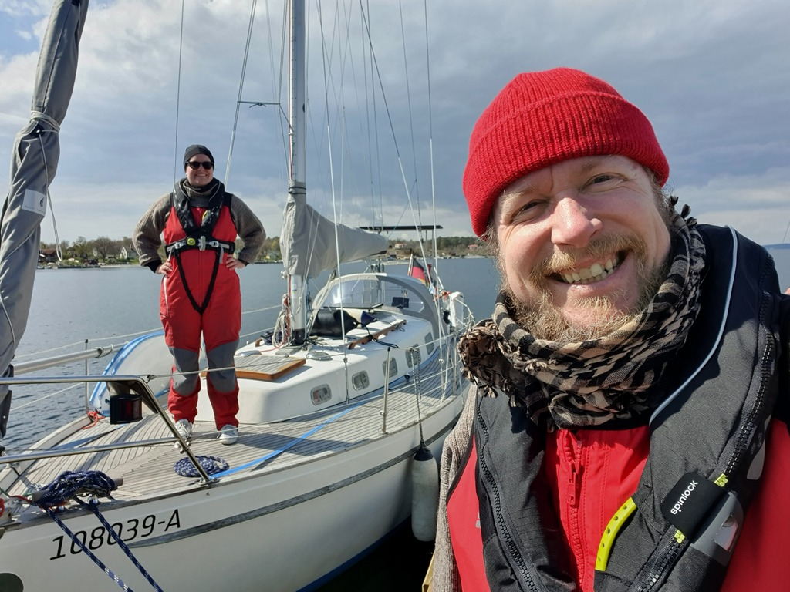

Having mentioned light winds on the Baltic in the last update, we had some of those in store. We wanted to make a longer passage, skipping the shallow sandy shores of southern Baltic and getting to the archipelago. For this, we were monitoring the forecasts and trying different weather routing solutions every day.

 

Eventually the right window opened for a late Thursday evening departure, where we'd have to leave the Danish island of Bornholm to our port side to avoid a major fishing contest and its hundreds of trolling boats.

Immediately after clearing the Swinoujscie wave break we switched on the autopilot and started our watch system. We do four hour shifts, with the person off-watch either sleeping, cooking, or cleaning (mostly sleeping). Between 16:00 and 20:00 we do two half-watches so that the schedule rotates. This is also the time for shared dinner and some time together (while both are awake).

Having followed various YouTube sailors over the winter, we borrowed a page from Sam Holmes' method and got pizza before leaving. This meant nobody had to cook in the beginning of the trip, and there was plenty to munch on during the first night watches.

 

The weather conditions were really light. Without major waves, the Baltic sea felt like a lake even off shore. This gave us a great chance to try our new Parasailor. At this stage we were hesitant to fly it at night, so we hoisted it in the first morning just off Bornholm.

 

After a bit of practice, the sail was giving us a very smooth andeffortless ride downwind (we tried angles of 90-180° apparent, and wind speeds 3-10kt true). Generally we were making about half of the wind speed as boat speed. Dousing was easy with the supplied sock. Gybing the parasailor we didn't get to try since the wind was constantly off our starboard.

As always, the game of Frogger clearing the main shipping lane of the Baltic sea was exciting. I wouldn't want to do that without good AIS setup calculating CPAs and times, especially in the dark like we did this time. As last year, this went without incident, and without need to call any ships over the VHF.

Due to the light winds, there was quite a bit of motoring involved at night time. If we had been comfortable flying the Parasailor at night, most of this would've been avoidable.

At Saturday noon we arrived in the Swedish island of Tärnö in the UNESCO listed Blekinge archipelago. We were here also last year, but this time it was side-tying to the pier since the buoys were not yet installed this "early" in the season. Time for a Swedish first of May experience!

 

* Distance this passage: 148NM
* Total distance: 292.6NM
* Engine hours: 9.9
* Midnight snack: pizza
* Breakfast: sandwiches
* Dinner: spaghetti Bolognese 
* Breakfast: oatmeal porridge with apple jam
