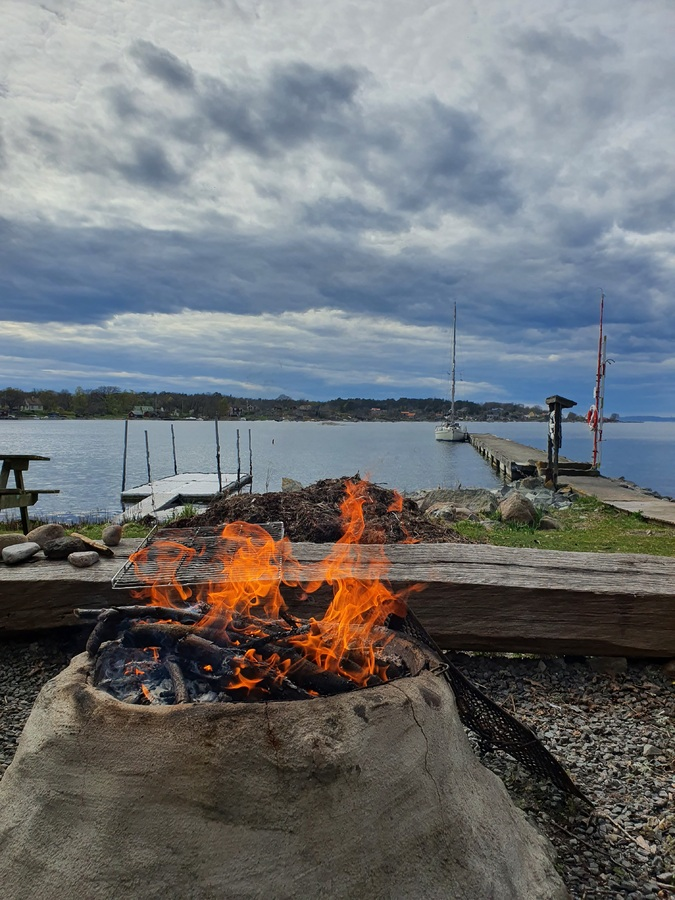

Tärnö is a small island belonging to the Blekinge archipelago. In Tärnö we hiked one of the nature trails, sat at a bonfire on 1st of May and got a visit from the Swedish (and most polite) coast guard. The pier was free and is maintained by the Bryggeförening.

We filled up our water tanks and finally installed the chain stopper with it's backing plate.

