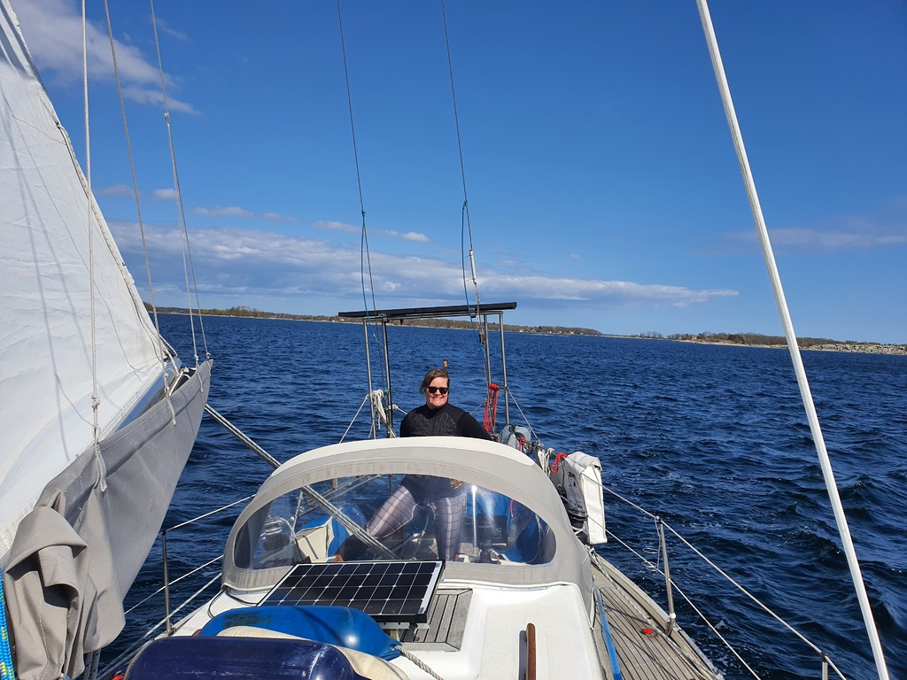
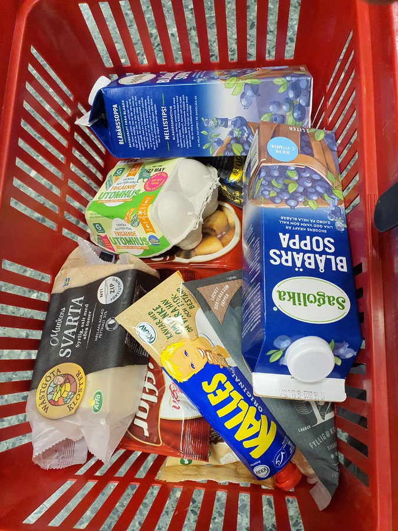

Sadly the EU _"roam like at home"_ is quite inadequate for the modern internet, and so we ran out of our monthly roaming quota in just two days of boat office. This meant it was time to head to a town and get a local SIM card.

Quite a lot of the guest harbours on Swedish coast are still closed for the winter season, but a visiting sailor told us that a boat club next to the town of Karlshamn would be open. We'd just have to pick a berth with a green marker.

 

After work we left the Tärnö pier, hoisted up the sails and navigated to Svanevik between the skerries. The brisk southeasterly wind made this a quick trip, and just an hour later we were tied up in the marina. A bit of shopping followed.

 

* Distance today: 4.5 NM
* Total distance: 297.1 NM
* Engine hours: 0.1
* Lunch: coconut curry with leftover lentil patties from May 1st
