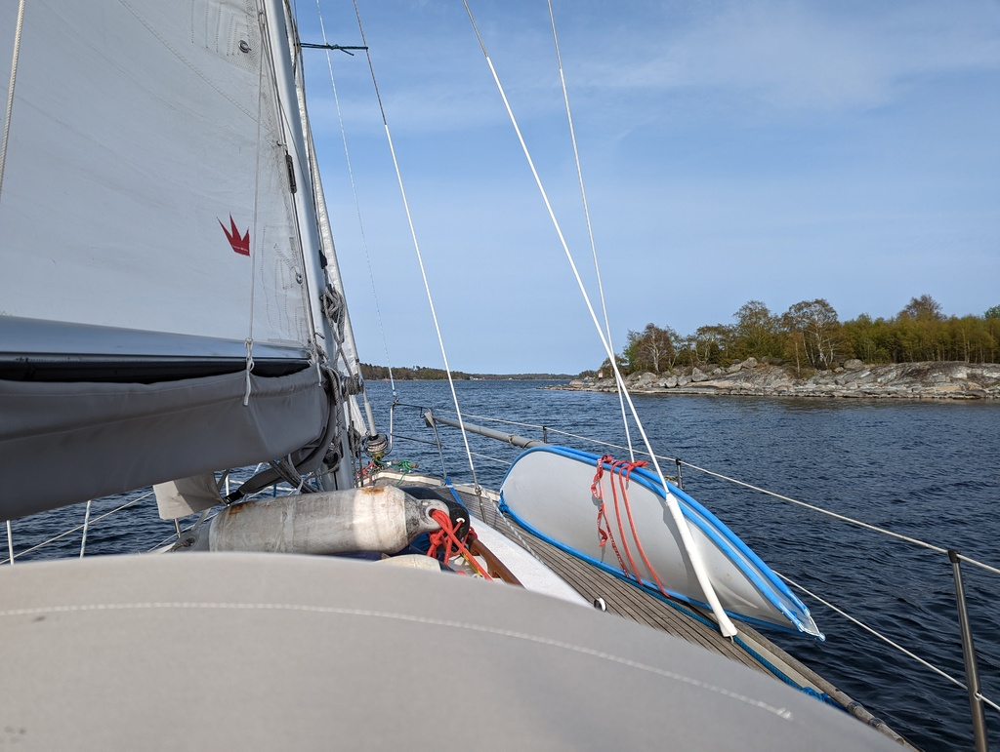

Having done our business with the civilization, it was time to find our first Swedish Cruising Club (SXK) buoy. These are free for the members to use for a day. We again left harbour right after work, and started tacking up the narrow passes between the skerries.

 

It felt at times like a proper workout!

Since the wind was completely on the nose, we took the outside route, avoiding the narrowest parts.

We turned the motor on 2.5NM before the buoy, and timed it perfectly so that we were tied up one minute after the sunset. The bay we're in is quite scenic, looking forward to seeing it in a better light.

 

* Distance today: 15.4 NM
* Total distance: 312.5 NM
* Engine hours: 0.5
* Lunch: feta avocado salad and freshly baked rye bread
