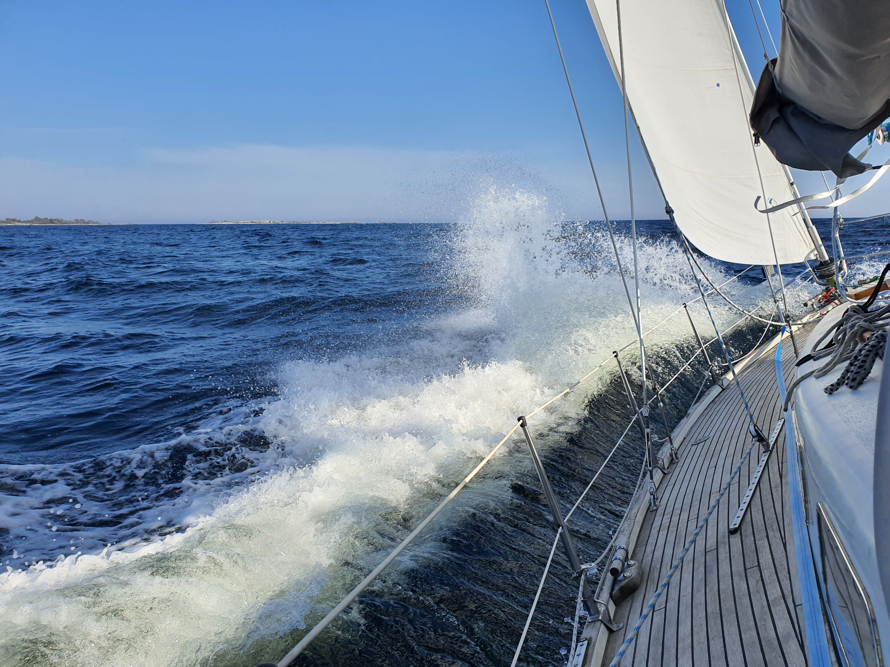
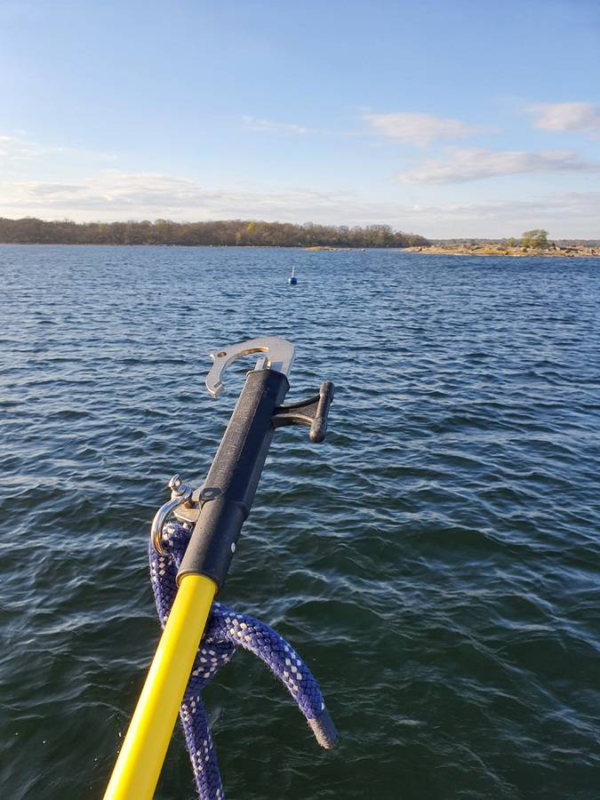

Workday was spent in a picture perfect bay with cute summer cottages surrounding us. The soundscape though was the roar of Gripen fighter jets flying over us multiple times. So much for the perfection.

The day was sunny and we were protected by the island so much that we had all of our solar panels out. That is a whopping 510W! By noon, our battery was at 100%.

After work we turned on the engine, released us from the mooring ball, pulled the sails up on the spot and headed east towards the next SXK buoy. More or less a constant wind of 17 kt conveyed us on a speedy sail to our destination. 

 

Our route took us on the outer side of the archipelago so we got to enjoy some big Baltic waves.  I'm so happy with how Lille Ø just swims through the big swell!

 

We approached the mooring ball with sails down and wind from the back. The easy-catch that came with the boat has proven its might, with a swift yank the mooring ball was caught and with a bit of engine breaking we gracefully turned to meet the wind on the ball. Now it's time to enjoy the view and the solitude of early season.

* Distance today: 10.6 NM
* Total distance: 323.1 NM
* Engine hours: 0.3
* Lunch: pea soup
