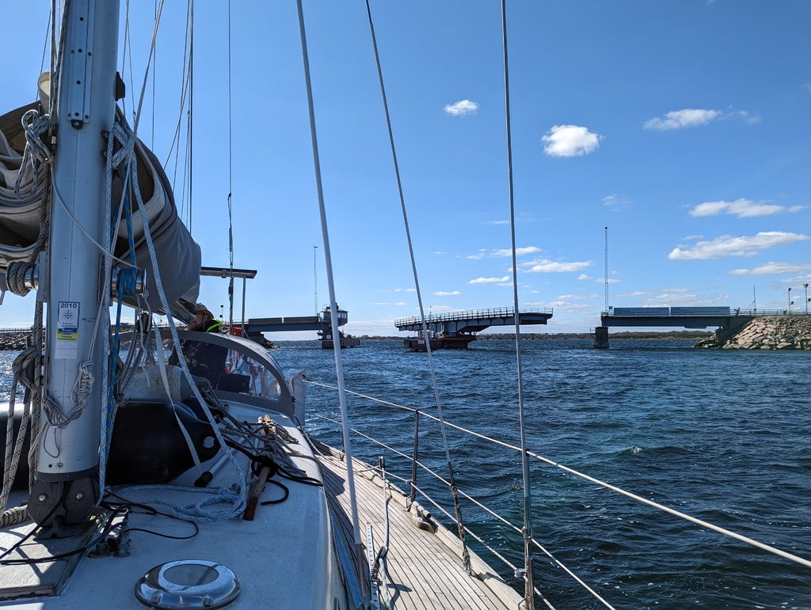
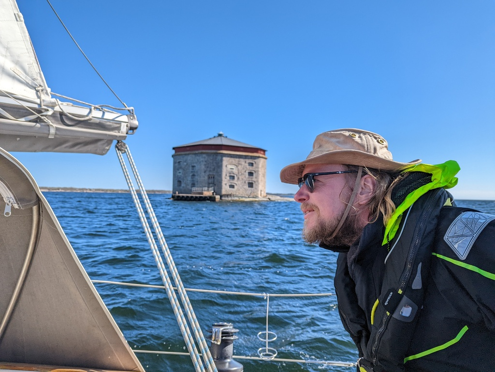
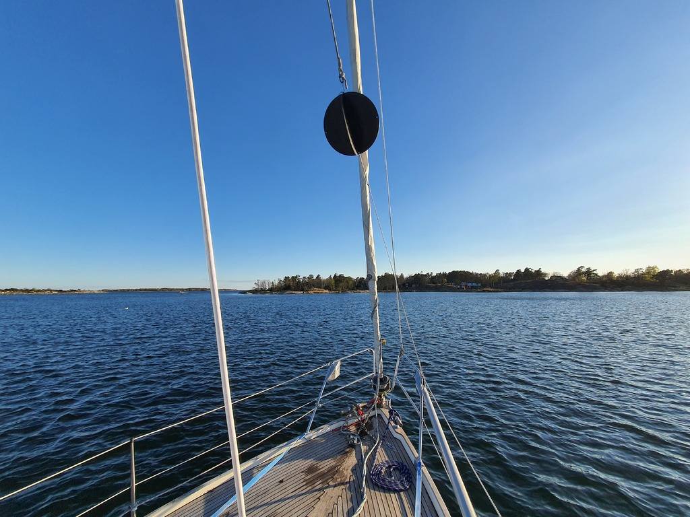

Once the workweek was complete and laptops stowed away, we started our trip east. Since last year we sailed the outer route around Karlskrona, this time we wanted to try the inner route that goes right by the city.

The first step was an opening bridge to the island of Hasslö. We called the bridge operator, and booked a slot to motor through. The bridge swung open right on schedule, and we were quickly on the other side, taking up sails.

 

Today's sail was a brisk downwind run, making a few gybes along the way to go around the skerries and Karlskrona harbour fortresses. The fortress island of Godnatt was again a welcome sight.

 

Our initial target was a SXK mooring ball on the north side of the island of Senoren. We sailed under another bridge  caught the buoy, but then decided that the place was both too unprotected and too shallow for comfort.

We decided to sail another 6NM to the next buoy. This took us though a narrow winding fairway with a cable ferry. No problems. But sadly the buoy itself was already occupied. I guess the locals are finally starting their sailing season. We anchored to a slightly more protected spot off the nearby Hästholmen.

 

* Distance today: 18.4 NM
* Total distance: 341.5 NM
* Engine hours: 1.8 (mostly while setting anchor)
* Lunch: forest mushroom risotto
