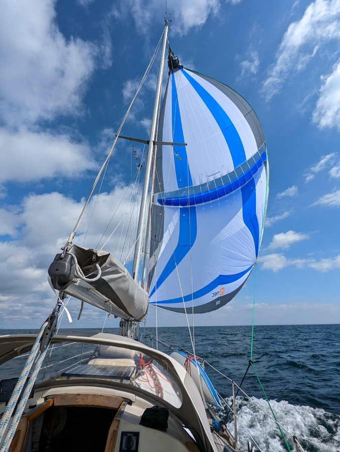

We started the foggy morning by hoisting the anchor after mandatory safety coffee. We motored the very narrow fairway to the open sea. On the first safe spot we hoisted the mainsail and pointed our bow to Kalmarsund.

Since the wind was staying aft of the beam we switched to the parasailor reducing rolling and gaininy us another 1.5 knots of speed. We utilized the smooth ride to cook a proper lunch. After lunch the wind veered forward of the beam and the autopilot could not cope with the gusts. We switched back to the white sails and continued on a fast beam reach towards Kalmar. 

 

We arrived at 5 pm, tied up with boom mooring and were met by the harbour master. Card payment right at the pier, what a service! Well be staying here for a week as Susanna needs to catch the night train to Berlin. The adventure shall continue in a week when Susanna comes back. 

* lunch: shakshuka
