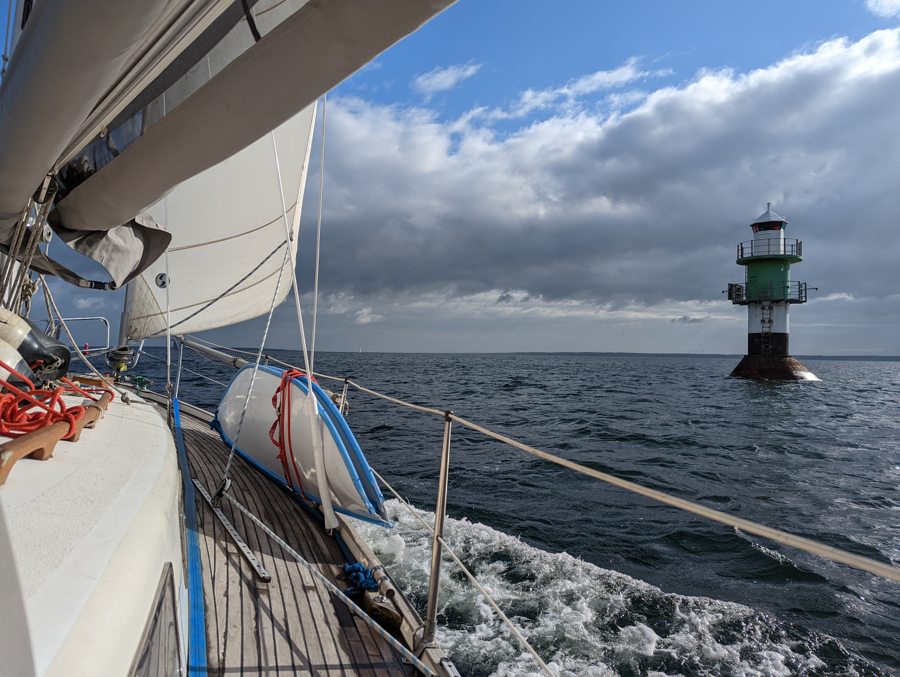
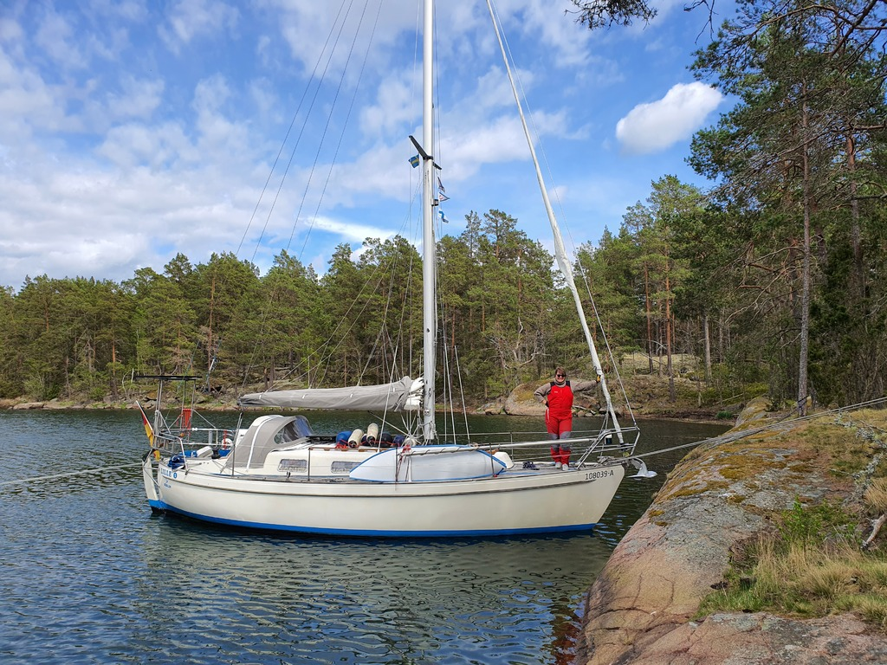
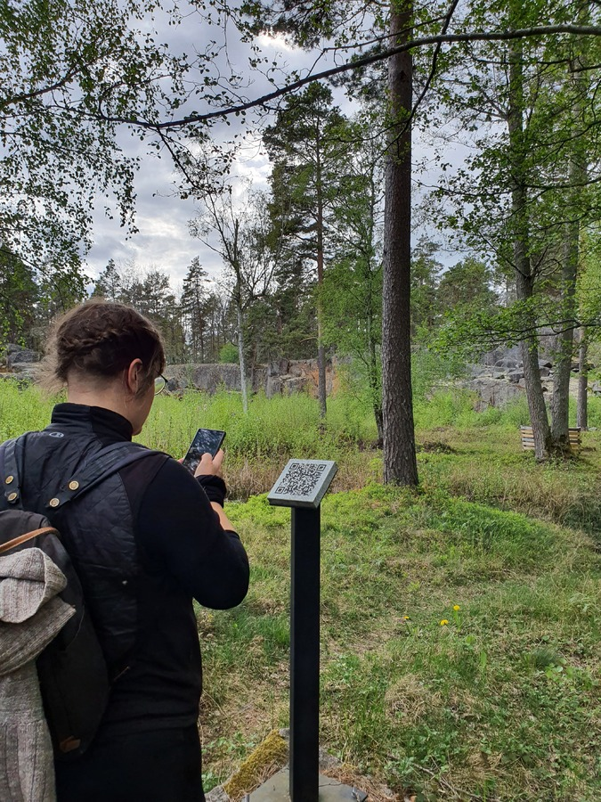

Susanna returned from her Berlin adventure, and it was time to leave Kalmar behind. It was kind of cool to have the boat on the central pier of the Kalmar Boat Show, but instead we wanted to find some nature.

We filled up water and diesel in the morning, and hoisted sail inside the harbour at 7:54. Then it was bow to the north, under the Öland bridge and up towards the Oskarshamn archipelago.

 

Today's sail was a fast one, with pretty constant westerly winds above 20kt on the beam. When the gusts reached over 30kt, we saw boat speeds around 7.3kt and decided to put in the first reef. This made the autopilot steer a lot better.

After the island of Runnö we decided to pick the season's first nature harbour, and tacked our way west to inside the island belt near the coast. 

When we reached the zigzagging strait that would lead us to the harbour we dropped sail and continued under motor at slow speed. One steering, the other on rock watch in the bow.

 

At the protected bay in Solberganäset we dropped the stern anchor and tied the bow to the shore. Finally, a proper Scandinavian mooring!

We explored the island a bit, and found a quarry museum. Very nice place for sitting down and watching the island nature a bit. Modern museums don't need signage, but instead Qr codes!

 

* Distance today: 40.3NM
* Total distance: 426.1NM
* Engine hours: 0.8
* Lunch: flammkuchen with sun-dried tomatoes and onions
