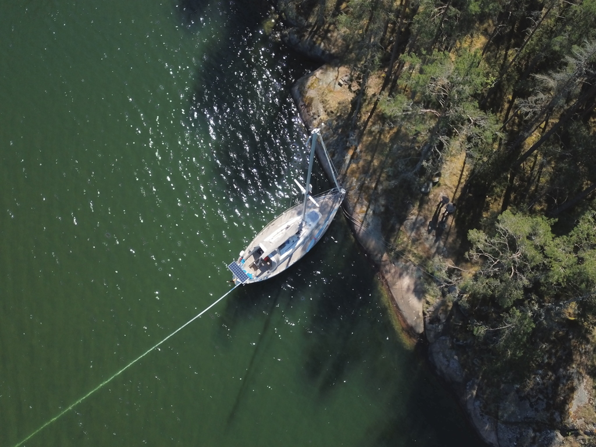
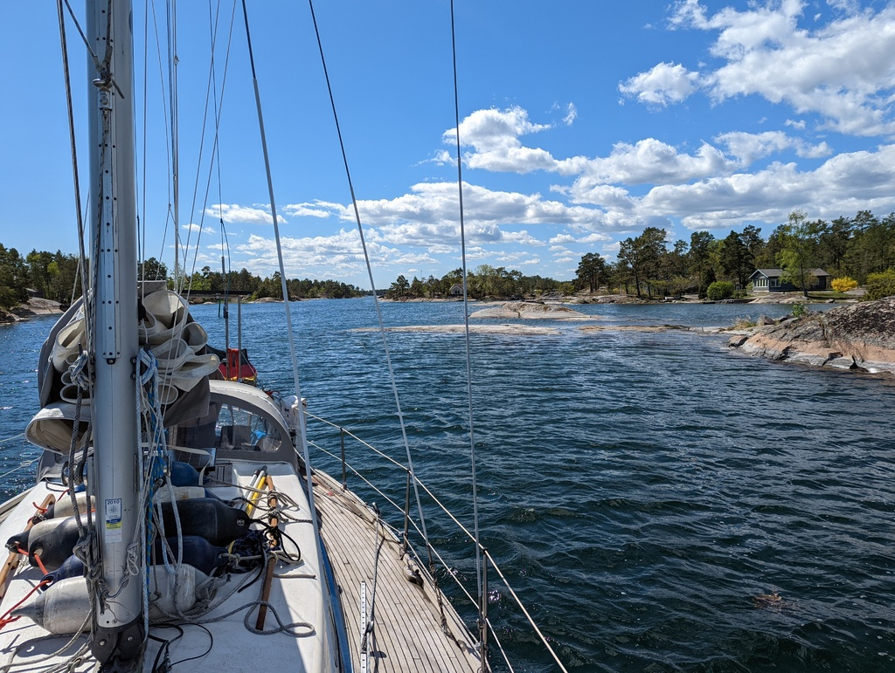
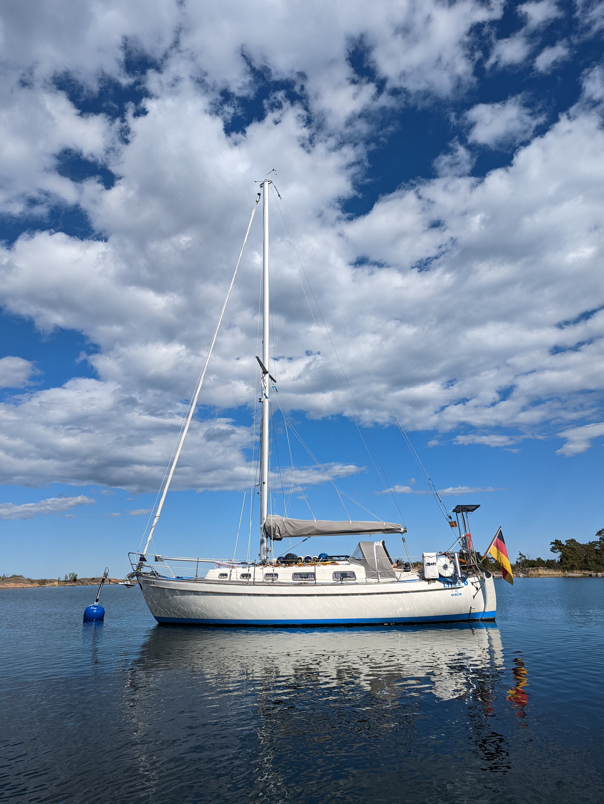
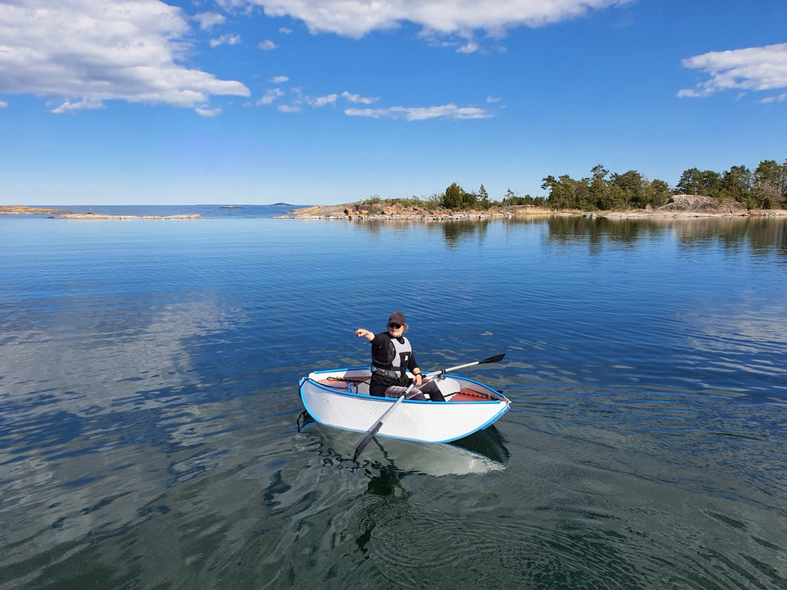

The morning started with some breakfast and flying the drone to take a higher look at the bay.

Solberganäset has a very thick mud bottom, which gave us great holding even with the on-shore winds. So great holding, actually, that it took both of us to get the 15kg Bruce rear anchor off the bottom.

 

We're now in an area where the harbour guide shows a lot of suitable natural harbours, so today we decided to just make a short jump to a SXK buoy nearer to Oskarshamn.

Between the headwind and the labyrinthine archipelago channel, there was sadly no chance to sail, so today was just a bit over an hour of motoring. At times there were rocks just two meters from each side. No chance Lille Ø would be able to tack here, though it would be a lot of fun with a sailing dinghy! In any case the inner archipelago route was very scenic and totally worth the motoring day.

 

The bay at Kiddeholmen is very protected with skerries on all sides. The first hot spring day here in Sweden! We've been sitting in the cockpit just enjoying the view.

We also installed the new cockpit table leg (a Lagun like on our previous boat). After lunch we each took the rowing dinghy for a spin.

 

* Distance today: 4.1NM 
* Total distance:  430.2NM
* Engine hours: 1.8
* Lunch: spaghetti with tomato and bell pepper sauce
