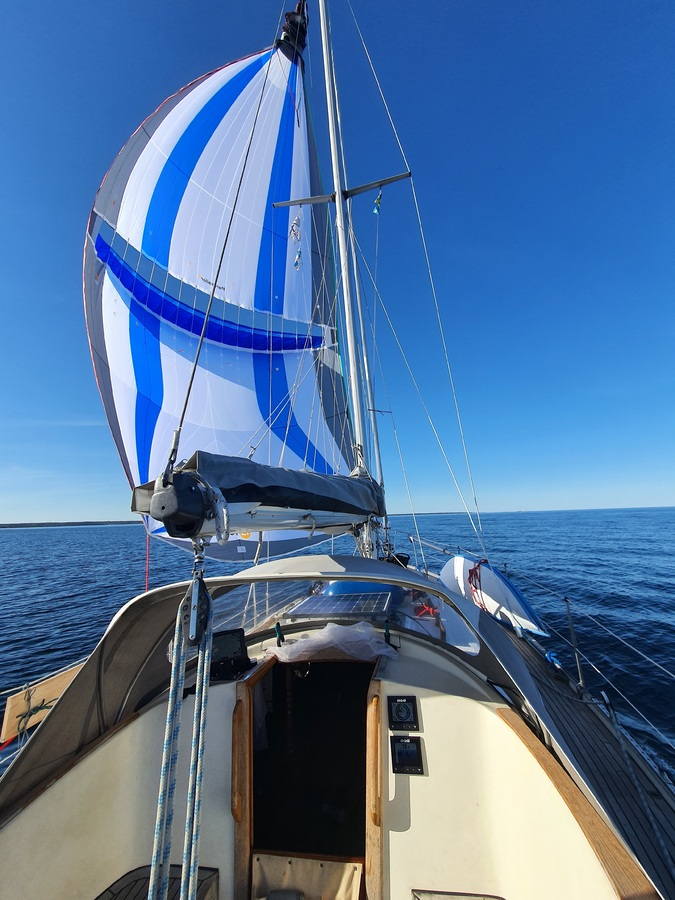
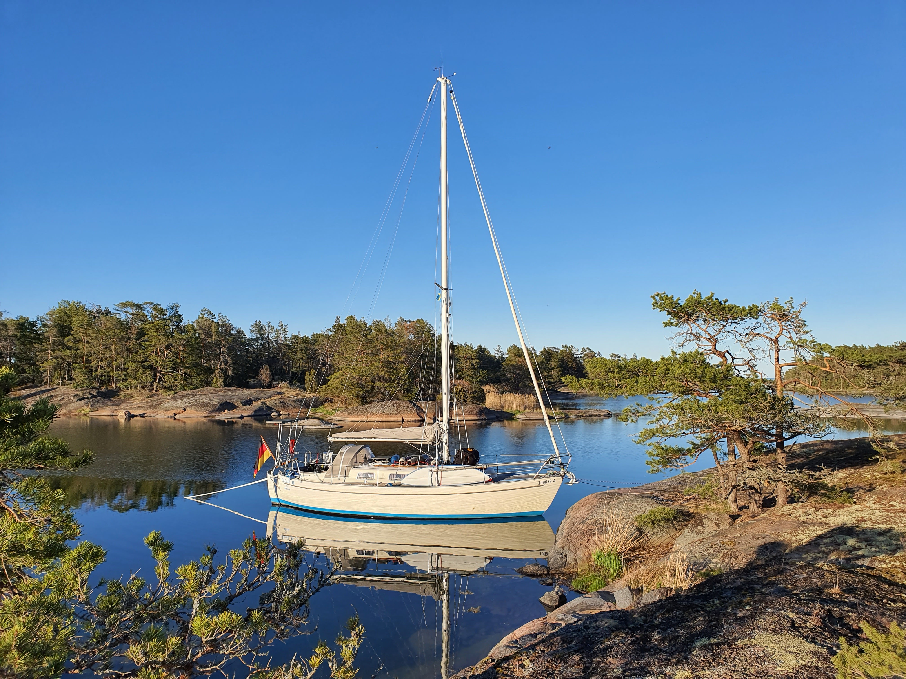

Sailing and motoring in the archipelago is truly a trust exercise! Are you where you think you are? Is the map correct? Is the rock that is supposedly 2 meters to your right really there or closer? Is the depth sounding correct, will 170cm of depth be enough? are there uncharted rocks? With all of these questions in your head you need to confidently and decisively steer your way towards destination through the labyrinth. 

Today we started after work and headed out of the sheltered anchorage. Winds were way lighter than forecasted, so after a couple of minutes with the traditional sails we popped out the parasailor. Without turning on the engine, we rolled in the jib, pulled topping lift tight, pulled up the parasailor in its sock and proceeded to drop the main and pulled up the spinnaker sock. So we were again on our merry way with the epic speed of 3 knots! 

 

Eventually the wind just completely died, so it was time to fire up the trusty Yanmar. Some intense navigation followed and we weaved our way through the rocky, twisty and narrow path towards destination. Then it was time to face the steep rock wall that was to be our mooring of the day. Drop stern anchor, steer towards the cliff face and remember to brake on time! 

 

* Trip distance: 7.2
* Total distance: 437.4
* Engine hours: 1
* Lunch: Coconut curry lentil soup
