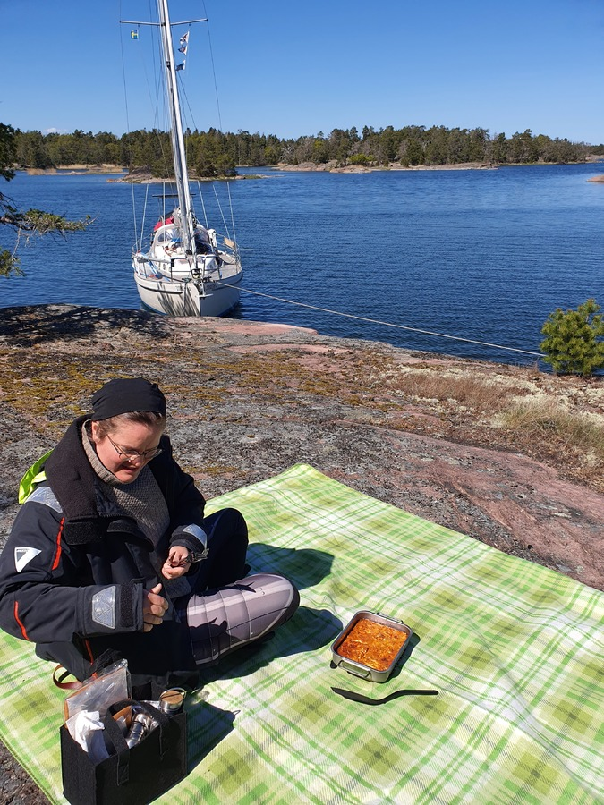
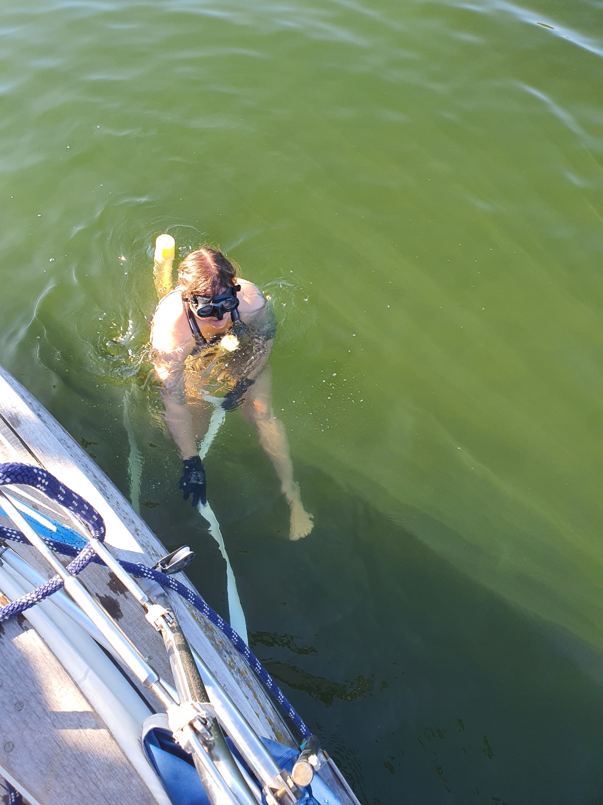
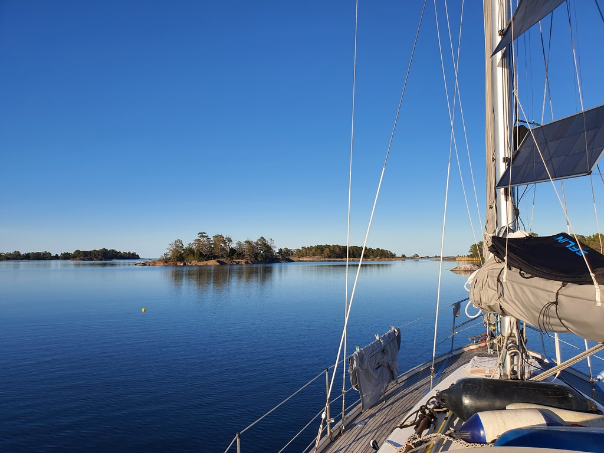

Todays lunch was enjoyed on the sun warmed cliffs soaking in the sun and surroundings. After work it was time to change the anchoring spot in a quest for finding better internet, as Wednesday was going to be a fully packed meeting day. 

 

We proceeded by fetching the land lines and started pulling the aft anchor webbing rode to get us out. A few moments of not paying attention, the boat slid over the webbing and it lodged itself tight between keel and rudder. We were still safely anchored, but also stuck. It was quickly decided that the best way to solve the situation would require the first swim of the season. Oh joy.

 

Susanna went in with diving mask, snorkel and a boat hook. Henri was on the deck dealing wit the webbing and passing in the boathook as needed. Some 15 minutes of puzzle solving and tugging later, the webbing rode was free again. After drying and clothing Susanna up we were ready to proceed with the said anchor hoisting. The rest of it went without any issues. 

We motored roughly 500 meters, checked LTE connectivity, wind and depth (the three critical things for good anchoring), and dropped the bow anchor. It was time to turn on the saloon heater on high and thaw Susanna out.

 

* Trip distance: 0.3 nm
* Total distance: 437.7 nm
* Engine hours: 0.6
* Lunch feta spinatch lentil quiche
