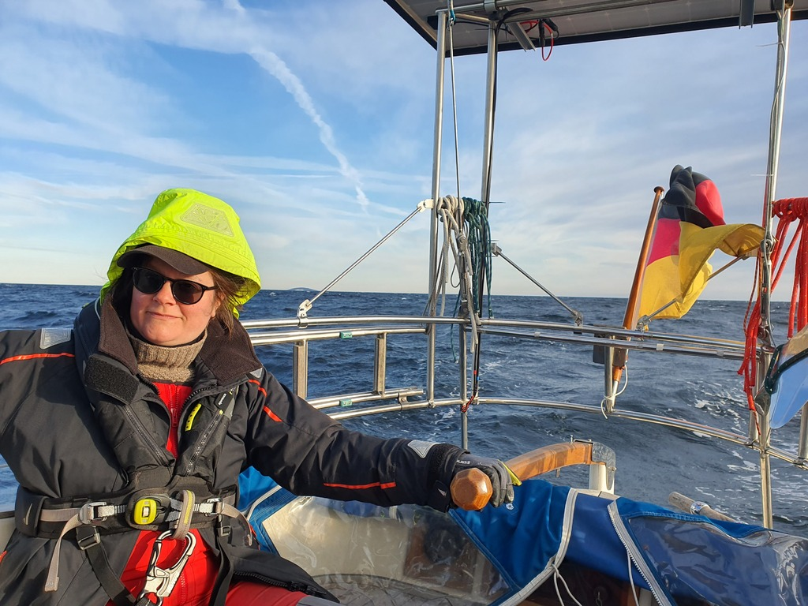

Today was quite windy, with a brisk southerly blowing through the anchorage. We moved the boat around noon a couple hundred meters to a position with better holding. Last night's anchorage was stony, so the anchor didn't handle the 180° wind shift too well.

 

After work it was time to set sail again. We motored out of the narrow fairway, hoisted sails with first reef, and enjoyed a very fast beam reach with following seas of about 1m wave height. At a point we clocked our fastest-ever boat speed of 7.7k!

 

Approach to the very sheltered anchorage north of Ävrö was a bit hairy with this weather: a narrow unmarked entrance with lots of rocks on both sides. But as soon as we cleared the entrance everything quieted down and we proceeded safely to the local SXK mooring ball. Another pretty spot, though with a slight hum from the nearby nuclear power plant.

* Trip distance: 10.2NM
* Total distance: 447.9NM
* Engine hours: 0.8
* Lunch: avocado feta salad
