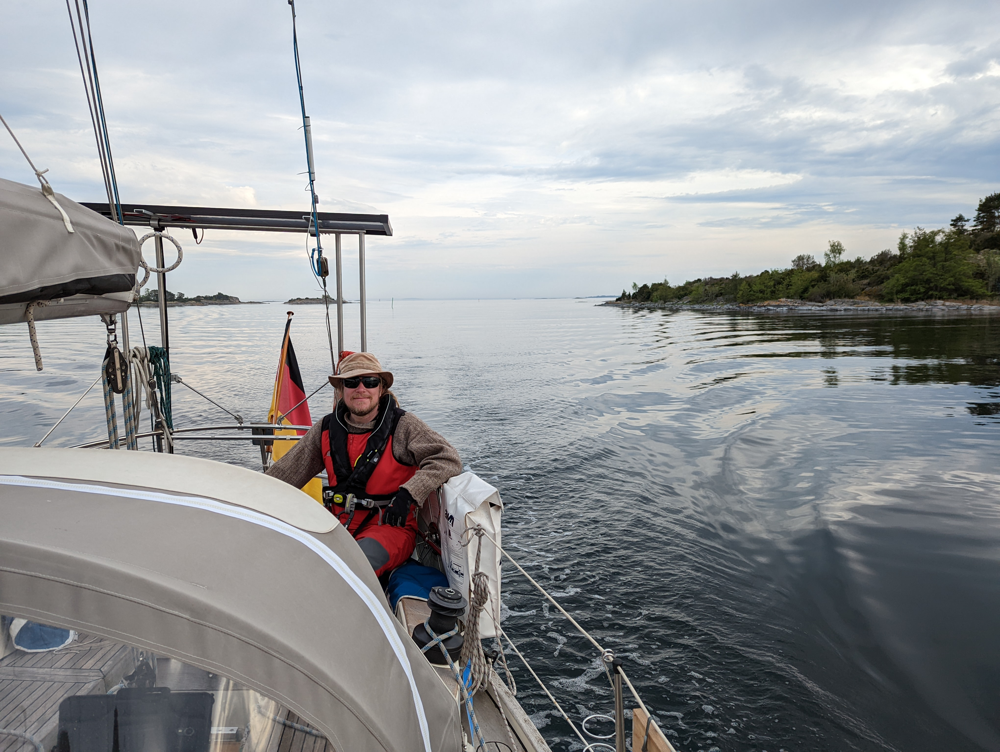
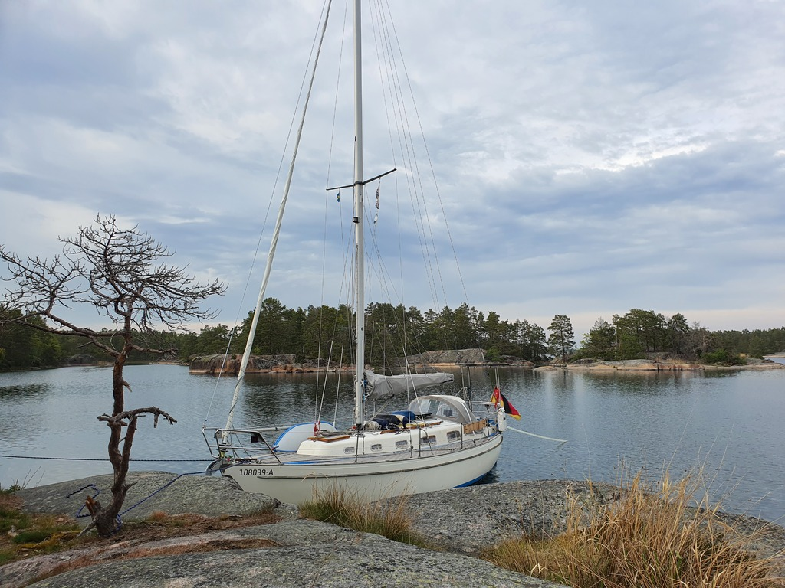

As the SXK buoys are for only one night use, we decided to motor onwards after work in search of a nature harbour. Instead of the forecasted 19 knots of wind, there were only 2 knots, and hence no chance to sail with the remainder of yesterday's swell.

 

Another weaving path between skerries followed. This time with a highlight of a Baltic seal swimming alongside the boat for a short while.

 

The entrance to Snuggösund is again a narrow one, but the nature harbour itself beautiful and full of places where a sailboat can tie to. The harbour guide tells that this place is totally packed during high season, but for the moment we have it all for ourselves.

* Distance today: 8.3NM
* Total distance: 456.2NM
* Engine hours: 2
* Lunch: pea soup
