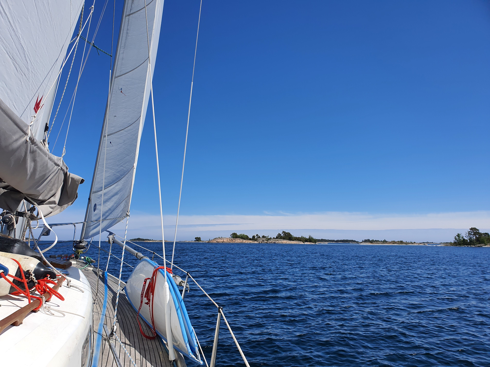
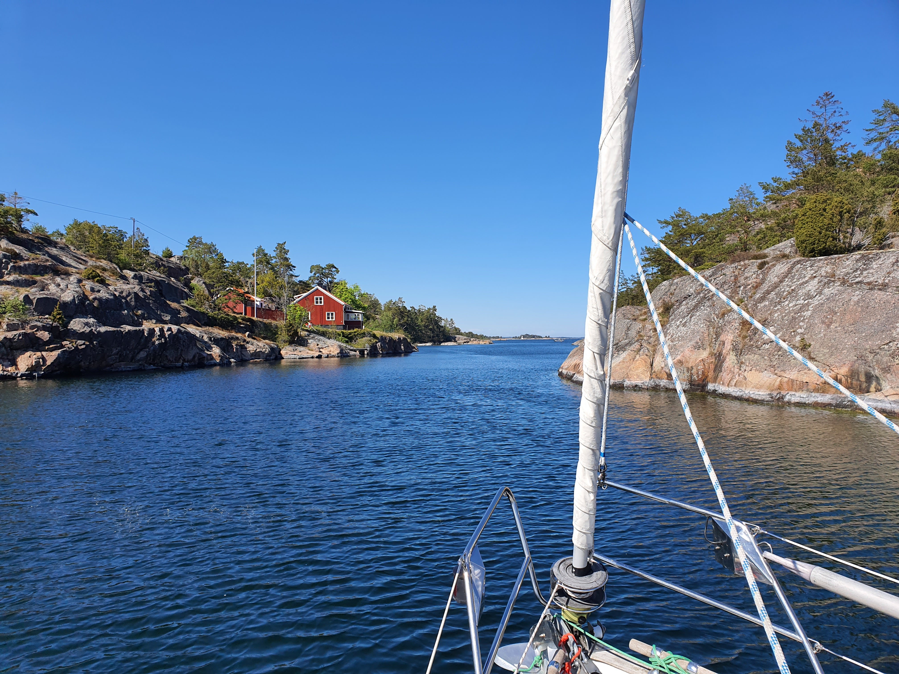

The winds for Friday and Saturday promised and delivered headwind and rain showers so we decided to stay in Snuggösund for couple of days.

 

For today the winds were still from the north but accompanied with sunshine and smaller waves we headed out. We tacked our way between the islands and the rocks enjoying the tight wind angles we were able to make. We were still doing ok with provisions and water (we ran out of beer!) but as Västervik was conveniently on the way, we decided it is time for a proper shower, some laundry and a grocery store run.

 

Today was clearly the day spring started in Sweden. For the first time on this trip, we encountered multiple sailboats and saw boats in the nature harbours we sailed past. Even the ice cream stalls in Västervik were open!

* Distance today: 18.7NM
* Total distance: 474.9NM
* Engine hours: 0.8
* Breakfast: oatmeal porridge with blueberry soup
