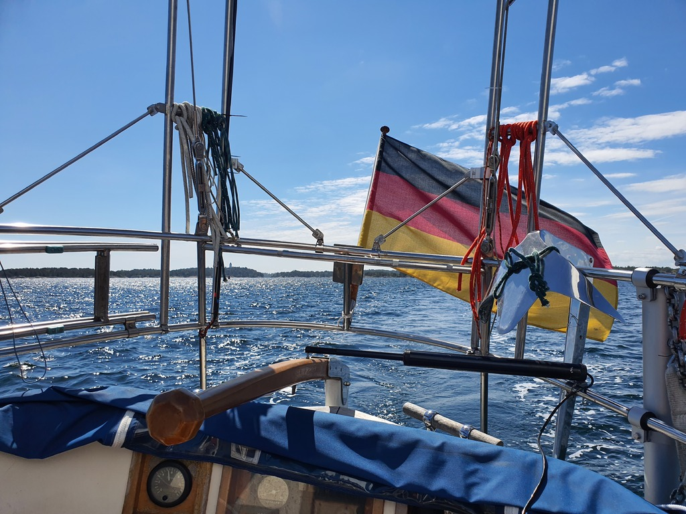
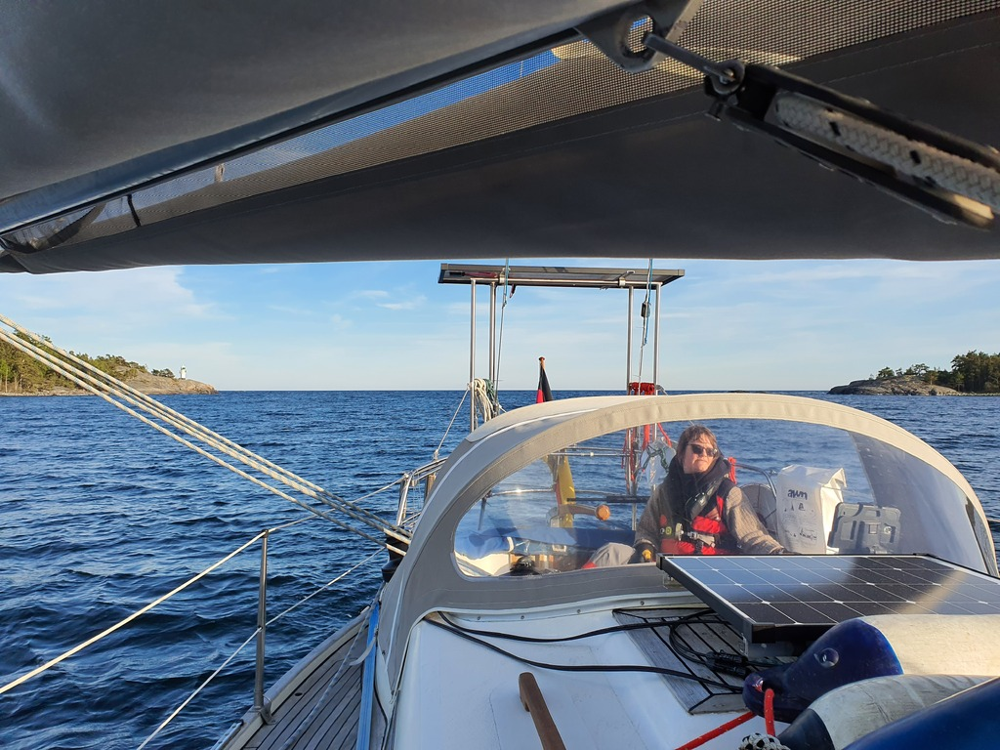

Today was the first day of Bergie's sabbatical. Last provisioning round in town (Systembolaget opens at 10), and then under way at noon. Suski continued working below deck.

 

Some short tacking was required to get out of the harbour, but then today's route was a delightful broad reach up the archipelago.

Some less protected off-shore segments and their heavy swell brought some complaints from the office downstairs. Apparently we were starting to near sea sickness.

 

After workday was done we did a shift change. Following dodging of some Swedish navy corvettes we arrived in the lagoon at Håsko. Both the harbour guide and Navionics claim that there would be SXK buoys here, but that appears to be obsolete information. We anchored instead.

* Distance today: 38.7NM
* Total distance: 513.6NM
* Engine hours: 1
* Lunch: feta spinach börek
