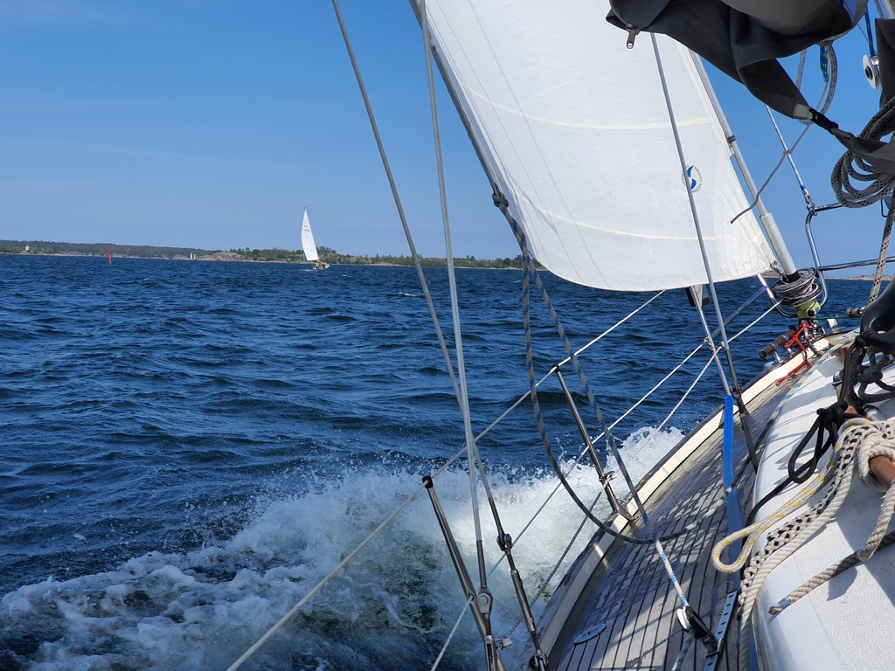
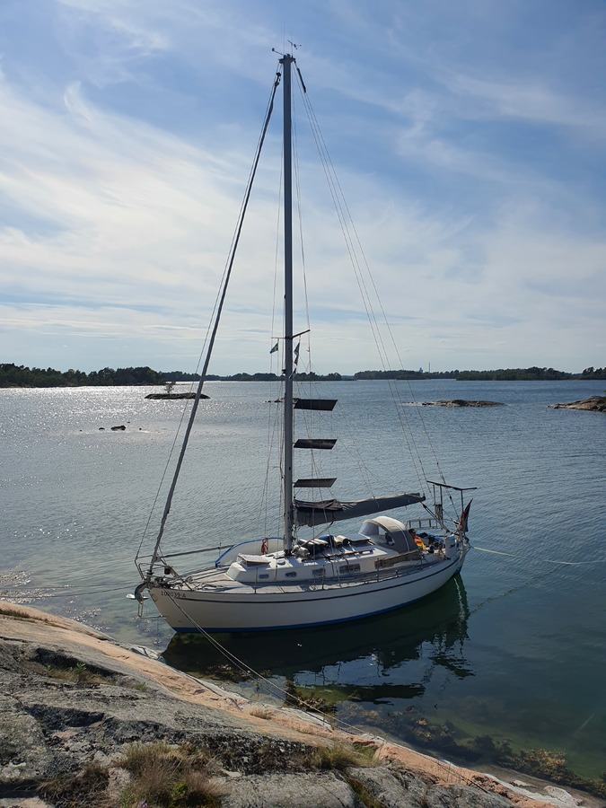

When the harbour guide said that the Håskö lagoon has good holding, it really meant it. When the anchor came up - after some struggle - it was a huge ball of thick clay. This would be a good place to sit out a storm.

The sun was shining and there was a good breeze from ESE, so time to sail! Bergie and our autopilot again formed Team Sail while Suski worked belowdecks. As today's brisk sail was all in the sheltered "inner passage", the only ergonomics complaints where about excessive heel when the gusts got bigger.

 

Just before Arkösund we passed the "emperor buoy" (green fairway marker topped with a crown) that we duly saluted. And then soon also a sailboat that we chased and passed.

 

With heavy rain in forecast we picked a sheltered anchorage and stopped already in time for cooking a late lunch. The local SXK buoy was occupied, so we went to the nature harbour in the next island. Time to prep our new cockpit enclosure for the task ahead!

* Distance today: 22.4NM
* Total distance: 536NM
* Engine hours: 1
* Lunch: spinach pancakes with lingonberry jam
