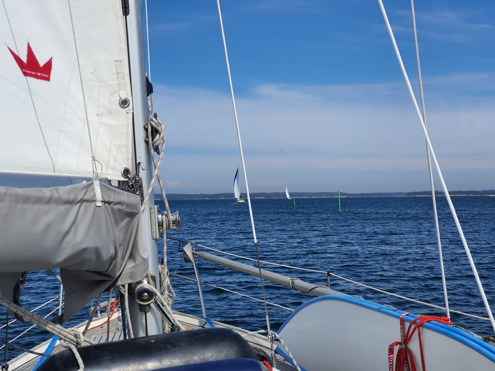
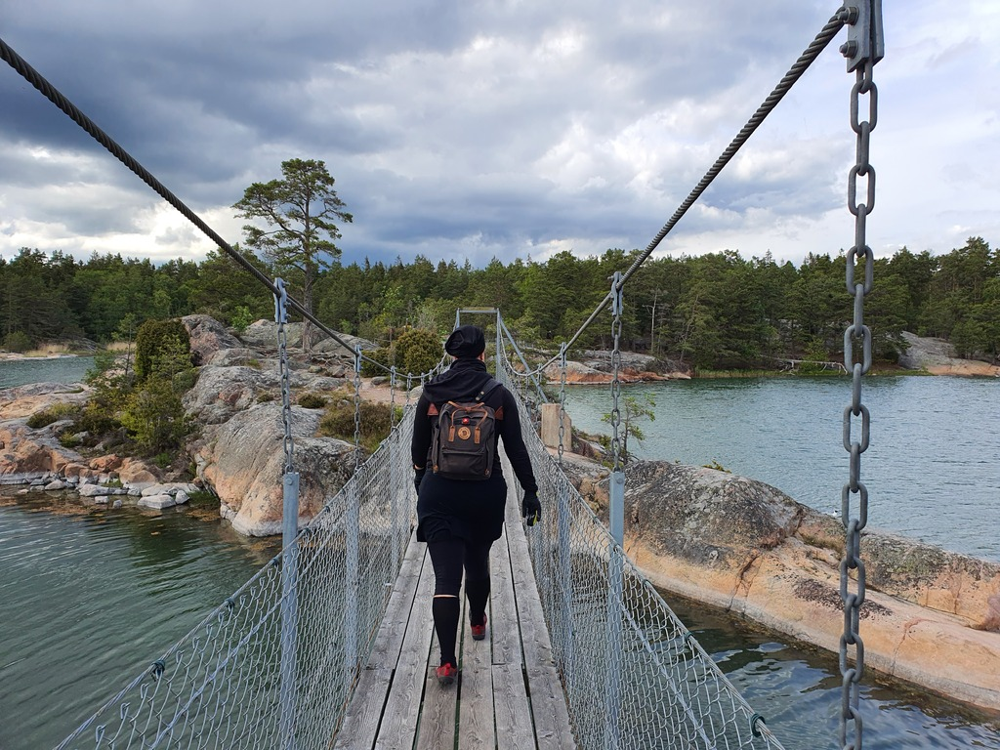
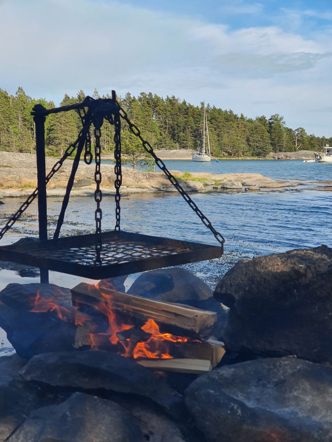

Wind shift in the morning made our Scandic mooring precarious, and hence it was time for an early start. A nice beam reach across to Oxelösund, and then following the winding narrow fairway downwind east from there.

 

The season really has started. This time we were sharing the fairway with multiple sailboats (even one with a Finnish flag). When we arrived to the Äspskärsfladen bay, there was already a boat occupying one of the two SXK buoys. We proceeded to tie up to the second one.

 

Once workday was over we assembled the banana-boot and dinghied over to the nature park we're moored next to. We explored some of the trails, and then grilled halloumi at a fire place next to the shore. Not a bad way to spend the Towel Day!

 

* Distance today: 19.3NM
* Total distance: 555.3
* Lunch: bell pepper and cheese wraps
