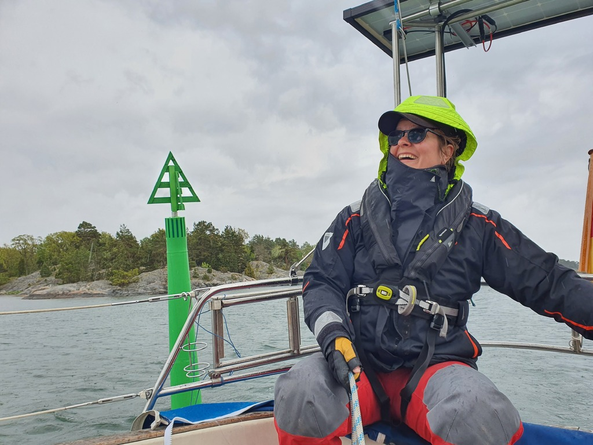
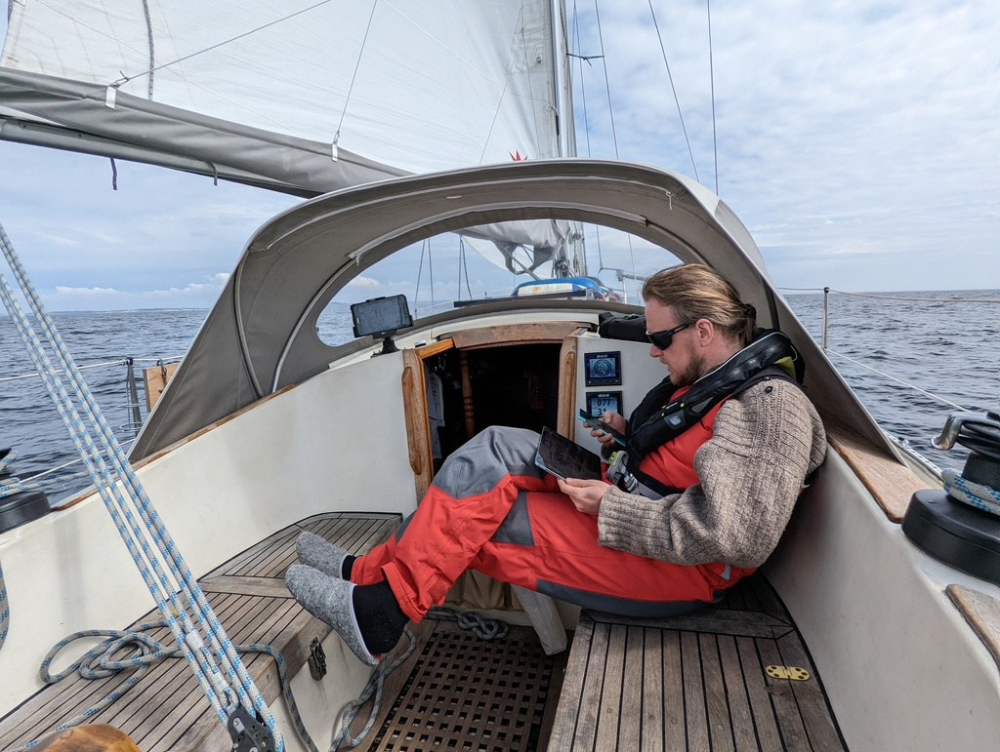

Today's sail started with some rain. We continued on a beam reach along the increasingly busy fairway east. At some point sun came out.

 

After consulting the weather forecast and maps, we decided to keep today's sail a bit shorter. We tied up to a SXK buoy inside a group of skerries. Again a pretty spot, but very rolly.

 

Boat projects and some book reading followed.

* Distance today: 16.6NM
* Total distance: 571.9NM
* Engine hours: 0.3
* Lunch: navy bean soup
