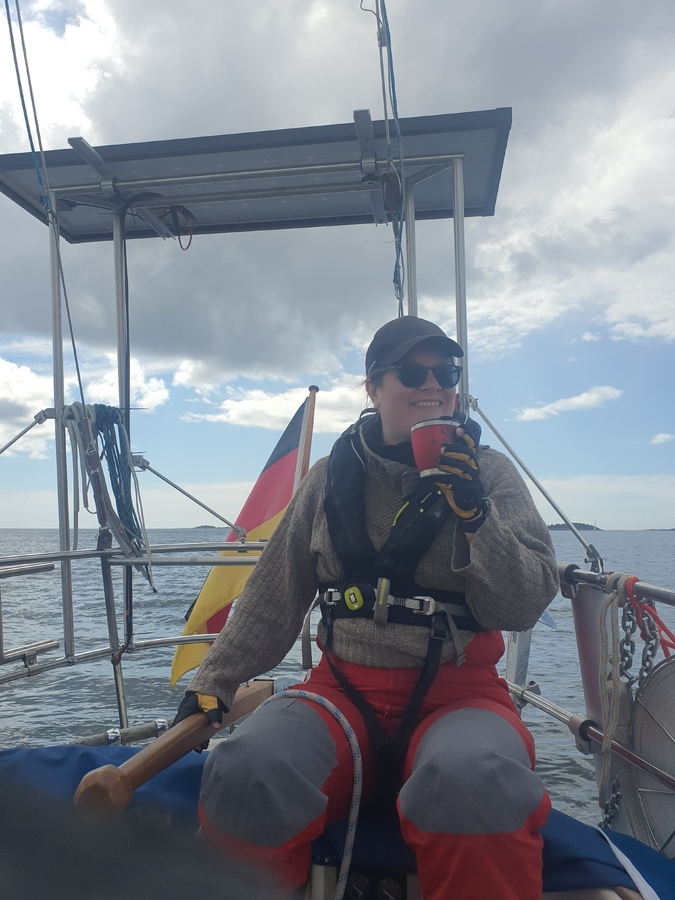

Morning started with sunshine and coffee. The rolling anchorage had lulled us into sleep pretty early, so we used the morning to clean up the boat.  We hoisted our sails just outside the anchorage and continued towards Nynäshamn with a pleasant beam reach. 

 

Finding the way between the skerries is tricky at times. It looks like you are steering towards a cliff wall until on the fairway reveals itself in between. We took the sails down just outside the harbour and engined in the narrow fairway. Just as we were starting our manouver, we got a surprise squall with 20 knots of wind. Yay. We got in with a bit of cursing as we were approaching a tad too fast and our aft line came loose. But, no damage to the boat or persons, only us diagonal in the empty box. Line by line we proceeded to pull the butt of the boat into correct orientation.

Tonight we shall enjoy the warmth of the sauna, tomorrow the rainy Stockholm and on Sunday we sail again with some extra crew fresh from Berlin.

* Distance today: 9.9NM
* Total distance: 581.8NM
* Engine hours: 0.6
