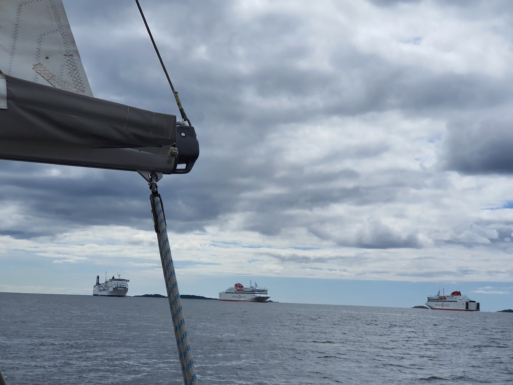
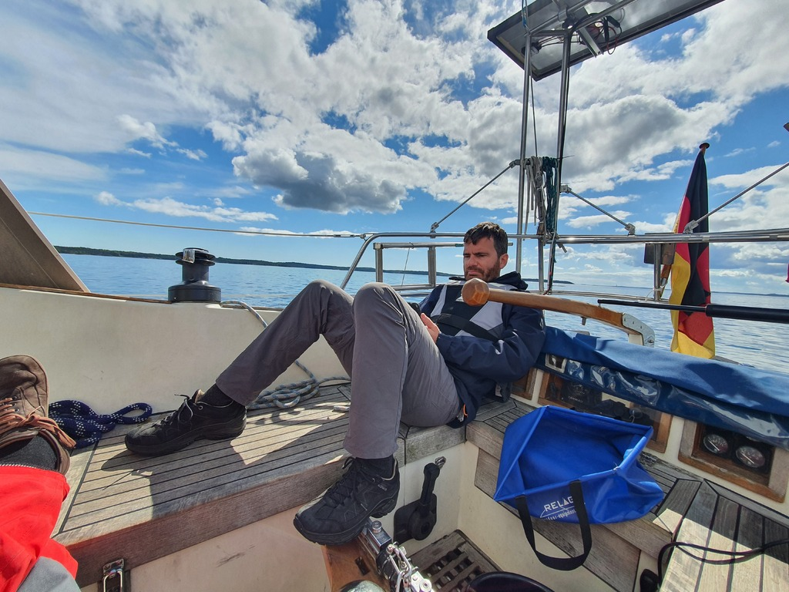
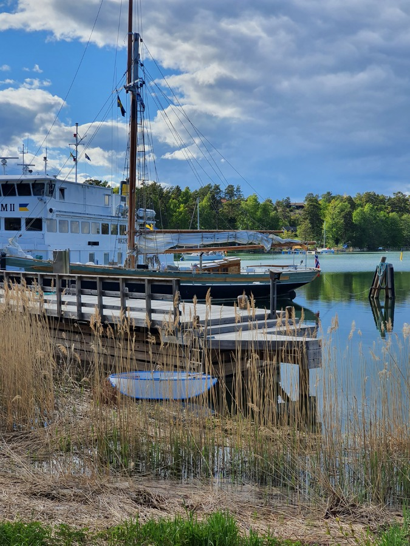

_To Finnish readers: not the Utö you're thinking of. This one is in Sweden._

Late morning after the route planning session last night. Coffee, breakfast, filling water tanks, and out sailing.

 

Initially we had a decent downwind course as forecasted. We dodged the ferries coming and going out of Nynäshamn, and even an unseasonable icebreaker. But then quite soon after the wind started dying.

 

We enjoyed a lunch while slowly drifting in the 0-1kt wind. But then after few hours of bobbing like a cork, we started the engine and motored to the Utö harbour where we could pick an SXK buoy. Dinghy to shore and a bit of exploring.

 

* Distance today: 12.3NM
* Total distance: 594.1NM
* Lunch: forest mushroom risotto
