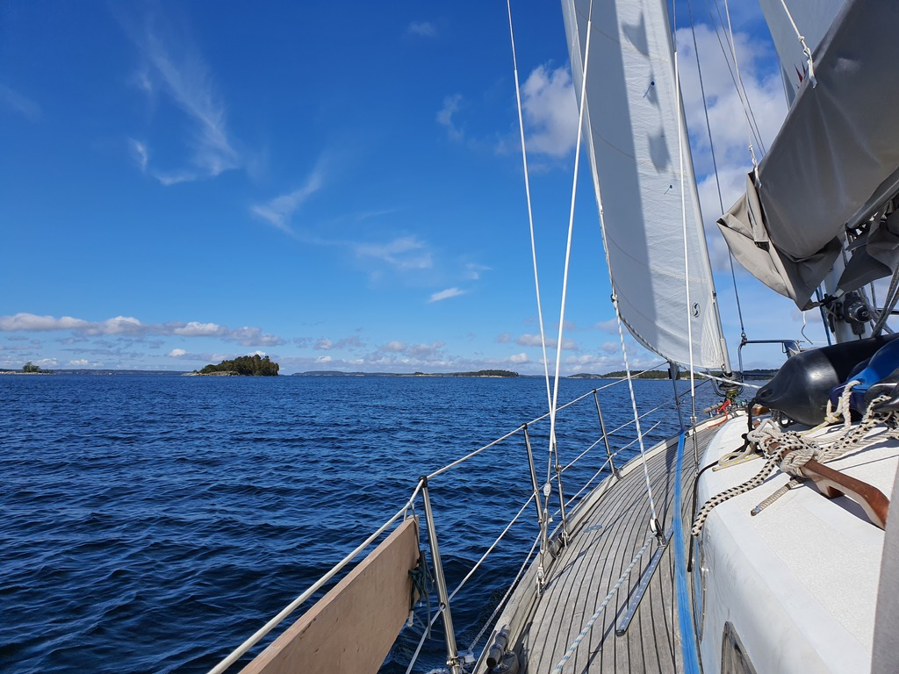
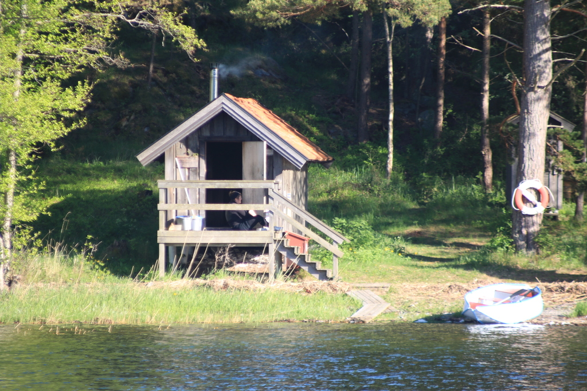

After breakfast we first let the Norwegian tall ship leave the harbour, and then untied the mooring ball and followed. Apart from a narrow part where a few short tacks were needed, today was an easy sail with about 9kt of wind 50° off our bow.

 

With the good going we decided to pass most of our pre-marked nature harbours and seek the deep bay at the north end of Nämdö. This meant that we skipped from page 300-something to page 134 of the Swedish harbour guide.
Good to know there's a lot of new places left to explore on future trips.

The absolute highlight of Nämdö is that there is an open sauna maintained by the Stockholm Archipelago Foundation (50 SEK donation per person).

 

After tying up the boat to a Scandic mooring we assembled the dinghy, and Suski left off to heat the sauna. The rest of the crew followed in a bit with the necessary sauna-going gear. A few rounds in a proper wood-heated sauna, swimming in the cold Baltic, and a nice IPA was a great combination, especially when all of this happened with a full sight of Lille Ø!

* Distance today: 23.5NM
* Total distance: 617.6NM
* Engine hours: 1.1
* Lunch: spaghetti with avocado sauce
