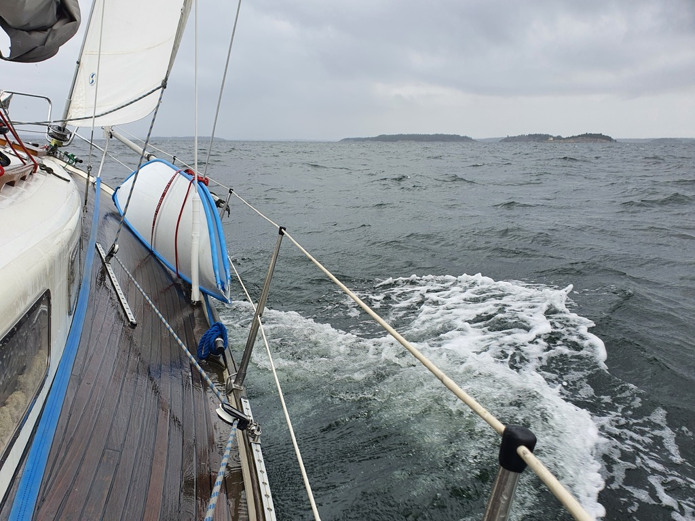
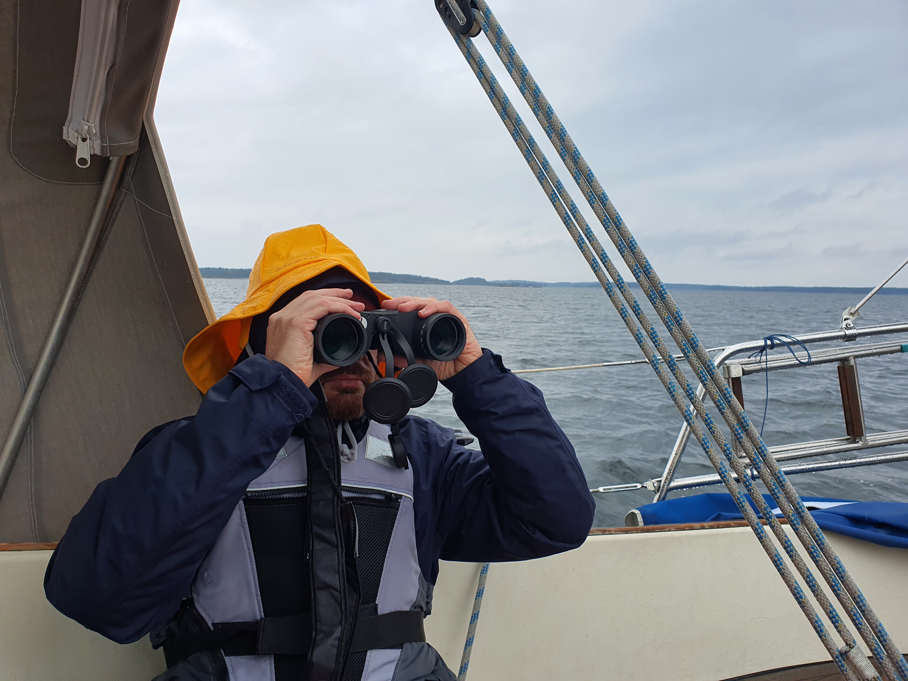

Rainy day, perfect for testing the sou'wester hats we bought from Stockholm.
After breakfast we untied the boat from the nature harbour, hoisted the anchor, and sailed off. The course was with some amount of tacking along the deep channel.

 

On Kanholmsfjärden we watched some exercises between a SAR boat and a helicopter as we sailed by. The helicopter did several close approaches to the boat, probably practicing how to pick people up.

 

We ended up tying to another SXK buoy in the harbour of Ramsmora at the island of Möja. It has to be said the cockpit enclosure is great for days like this. We could leave all the wet heavy weather gear to dry there and keep the inside of the boat more cozy.

* Distance today: 18.3NM
* Total distance: 635.9NM
* Engine hours: 0.7
* Lunch: coconut curry lentil soup
