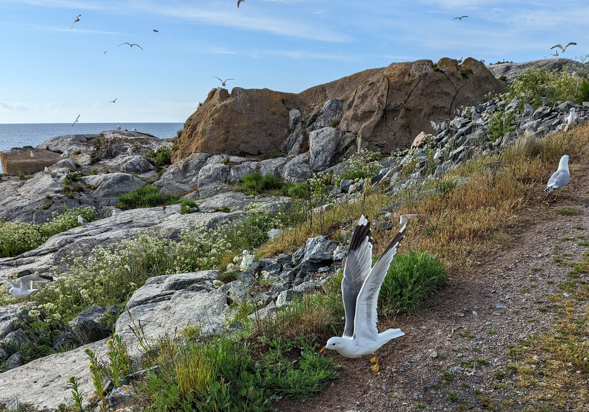

We took a late start charging our batteries, as sun was shining and we were in a protected bay. At 13:30 Bernhard and Bergie started the engine and took the sails up. Couple hours later Suski joined the sailing crew after work. Very nice sailing followed with beam or broad reach and 1 meter waves. We were clearly on the outer archipelago already.

 

An hour before the forecasted 20 hours of rain we tied up at the visitors pier at the Söderarm lighthouse island. A quick tour on the paths followed, as there is seagull nests everywhere else. For us Söderarm is the last rock on the Swedish side! Now we sit tight and wait for a good weather window to cross over to the Finnish side.

 

* Distance today: 27.1NM
* Total distance: 663NM
* Engine hours: 0.9
* Lunch: spinach pancakes
