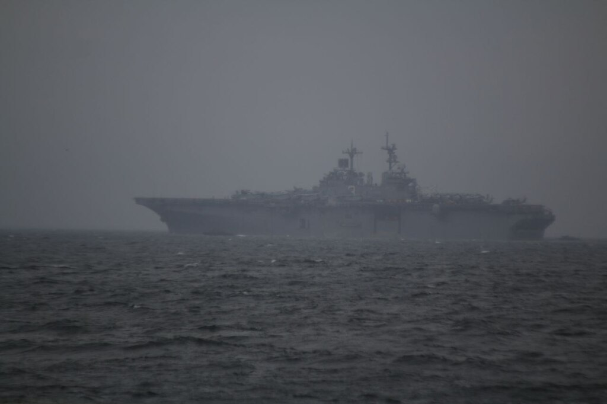
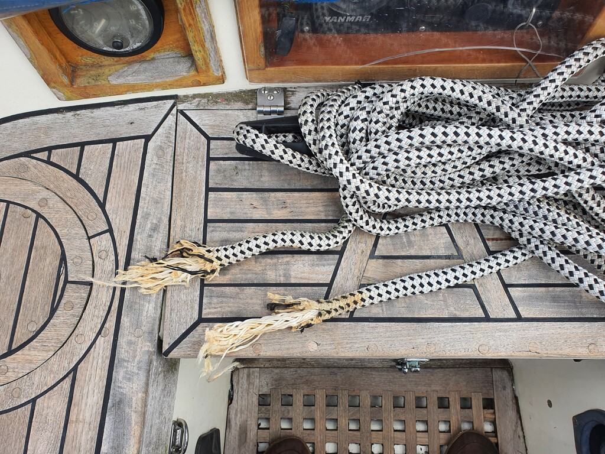
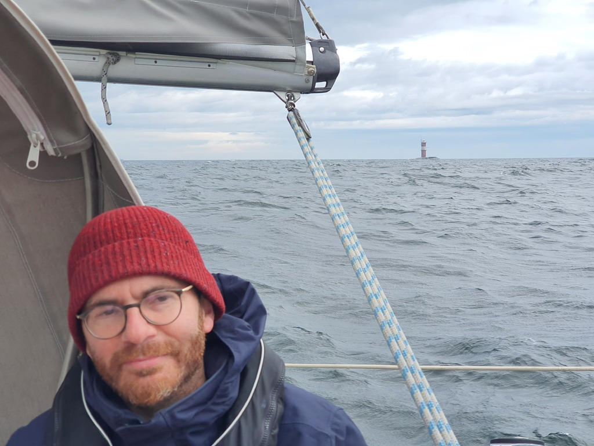
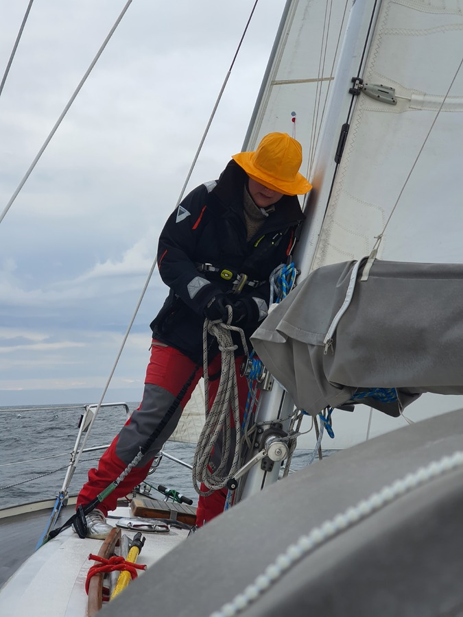
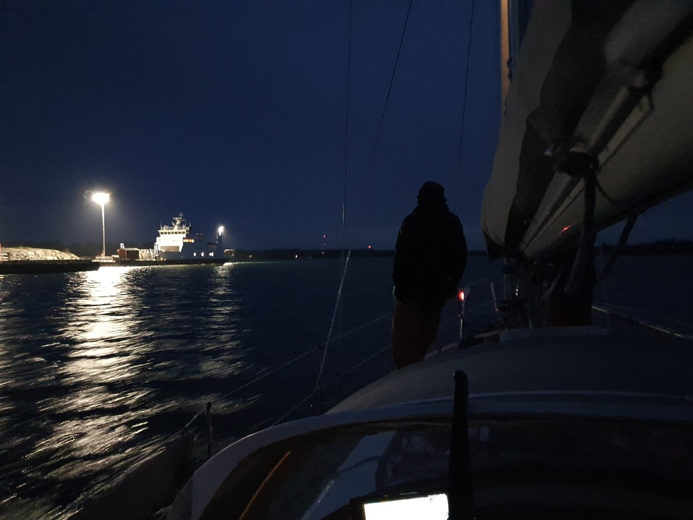

Have a nice lunch, bake some fresh bread, get some rest, and prepare the boat for the passage to Finland. That was the plan at least.

In reality, the low pressure that moved over Åland brought up to 56kt gusts. And a wave buildup to match. This was more than double what the forecast had. With it, the harbour in Söderarm became quite precarious. We didn't get the direct swell, but the echoes were big enough to roll the boat all ways, and mush our fenders against the concrete pier. With that, none of us slept that well.

 

Still, the island had some nice things to offer despite the rainy day. Having the Stockholm fairway go past us provided plentiful shipspotting opportunities, including a US aircraft carrier.

Around 14 the unexpected happened: our bow line chafed through, and the boat immediately rounded so that the aft was hitting the pier. Luckily we were just on deck planning the route and could react quickly. Motor to forward to push is back into the pier, and install an extra line to act as a new bow line. Then shoes and outdoor clothes on. We decided to get out of the pier and motor to a nearby protected bay. We motored around there until everybody had a chance to eat lunch and get dressed for offshore. And of course all this while bread was in the oven and pressure cooker pressurised.

 

Lesson learned: chafe protection gear on all shore lines, even if they look like they don't need it.

 

After lunch we pulled the sails up and started heading east. The offshore part towards Finland was surprisingly short, and went quickly despite the big waves from the north. When we reached the first rocks on Åland side, the swell subsided noticeably. Suddenly there were only some tens of miles of fetch instead of all the way from Lapland!

 

We had planned a slightly later departure, and because of this now we faced a nighttime harbour arrival on the Finnish island of Kökar. Luckily the northern nights aren't that dark this time of the year.

 

Now we're on harbour and have shore power plugged in for the first time since Kalmar. The recent rainy days depleted our solar production a bit too far, and as of today the alternator isn't producing power.
_Note: fixed since_.

* Distance today: 53.9NM
* Total distance: 716.9NM
* Engine hours: 5.7 (3.5 of them charging batteries in harbour)
* Lunch: pea soup
