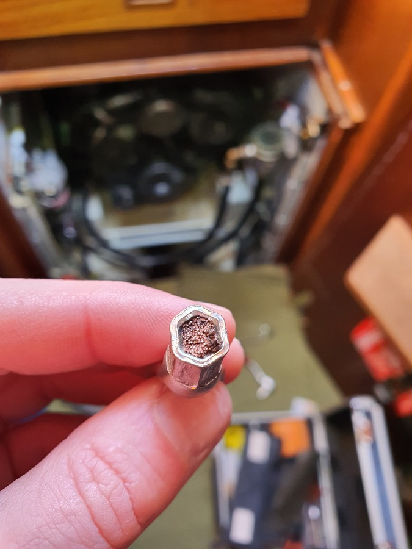
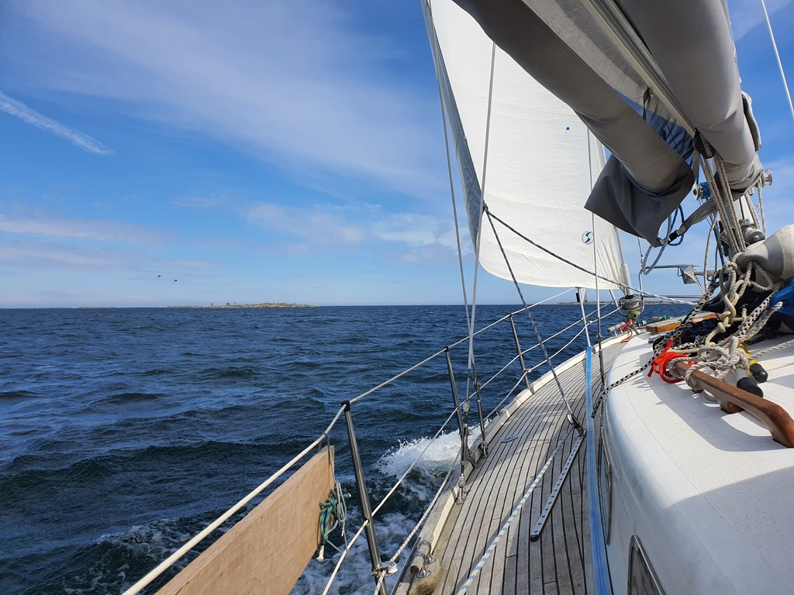
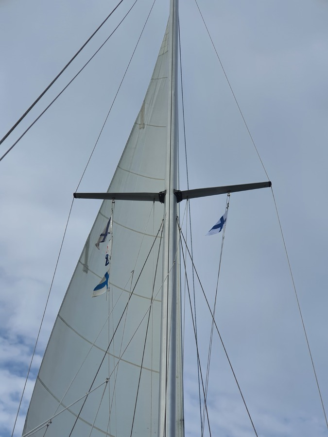
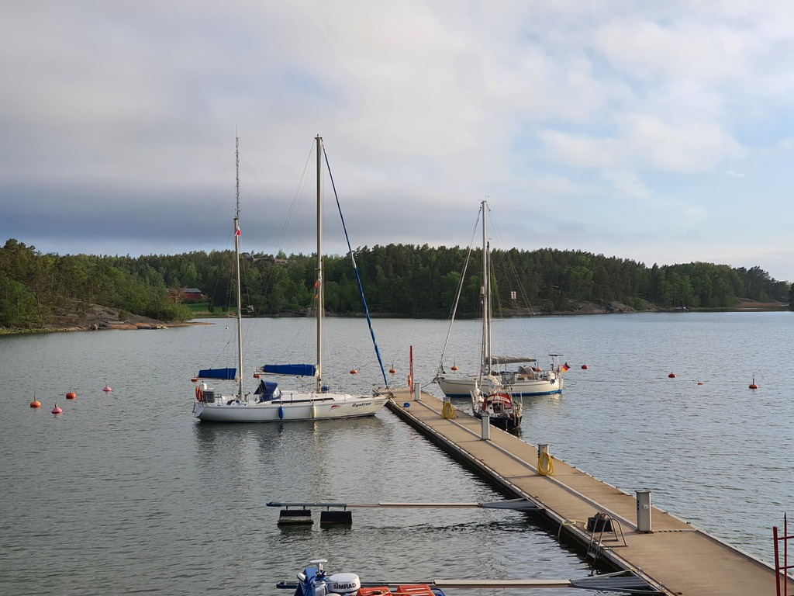

Having arrived at 2am, we started the day by sleeping late. After that, harbour check-in and breakfast in the cafe. German-flagged boat where the crew speaks Finnish caused some confusion as expected. Nice place, the salmon was wild caught just off the island, and we only had to pay half of a harbour fee as we arrived so late.

 

We fixed the broken alternator (a 25mm² wire had vibrated itself completely through at the crimp, luckily we have good electrical tools on board) and cleaned the raw water strainer (small mussels, some seaweed).

When the boat was ready, we started the trip to Finland proper. Lovely fast broad reach where we were seeing speeds above 7kt without any wave surfing. At the border we switched from the Åland courtesy flag to the Finnish one. A bit later we listened on the Yle merisää shipping forecast on the boat's FM radio.

 

Later once we joined the main channel to Turku with all the big Stockholm ferries the wind started dying. With the big waves we had issues keeping the mainsail filled dead downwind. So we continued under the jib alone.

 

When we reached the archipelago ring we were able to hoist the main again to get more speed and stability. Then a turn towards the Korppoo guest harbour, and sails down just before.

 

Some beer and burgers on the terrace. Tomorrow Suski needs to catch a bus to civilization for some family celebrations, so this harbour fits the bill.

* Distance today: 27.2NM
* Total distance: 744.1NM
* Engine hours: 0.7
* Lunch: egg and herring rolls
* Dinner: beer and burgers
