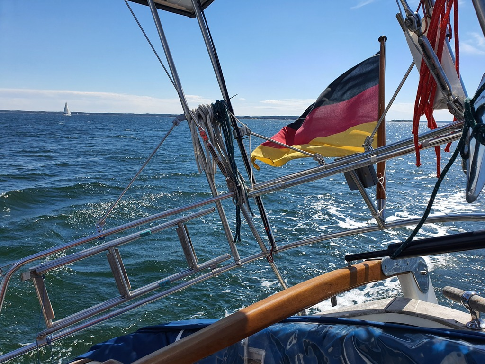
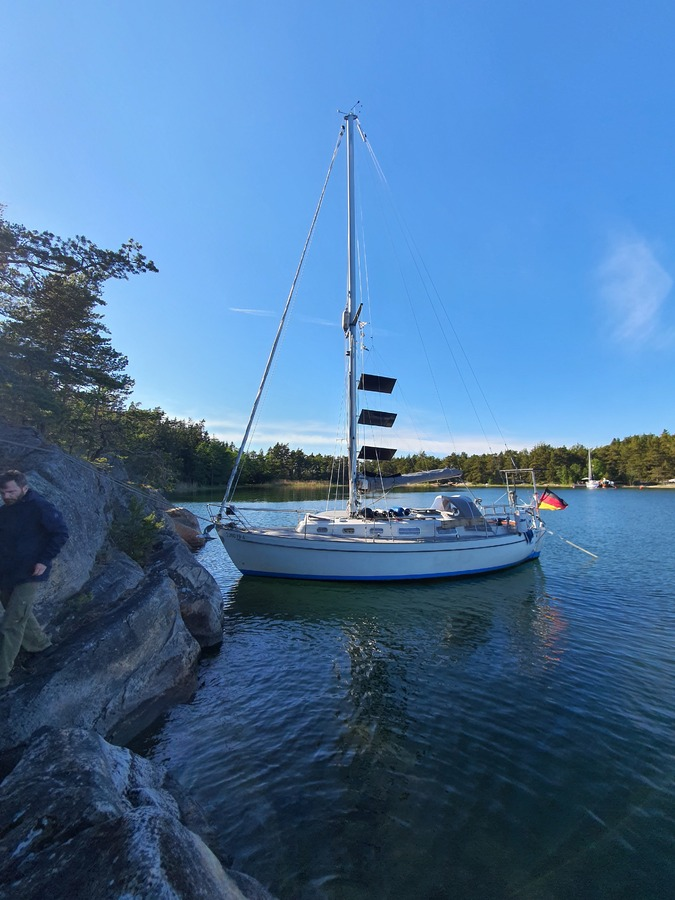

In the morning we escorted Suski to the archipelago bus, enjoyed a marketplace coffee, and did a bit of grocery shopping. Then got the boat ready.

Today was to be a bit shorter day. We're now in the inner archipelago, and the distances between nature harbours are not long. It being a weekend, it was nice to see bunch of other sailboats out.

 

After a couple of hours of beam reach we dropped sails and pulled into the nature harbour of Kuuskari. Anchor down and approach... And then we decided that it wasn't sheltered enough from the 20kt winds from the side. So anchor back up, and motored to the next island.

 

Here at Härjänmaa we're Scandic moored to a steep.cliff face. The Turku sea scouts harbour guide says that you could even side tie here. We have the bow to land, and 3.1m under the keel!

* Distance today: 15.7NM
* Total distance: 759.8NM
* Engine hours: 0.9
* Lunch: feta avocado salad
