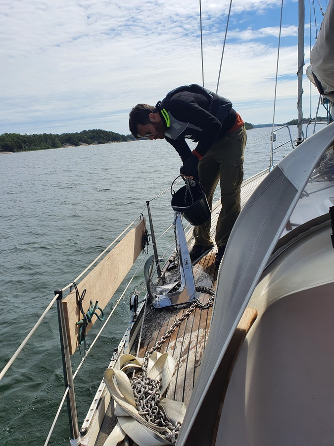
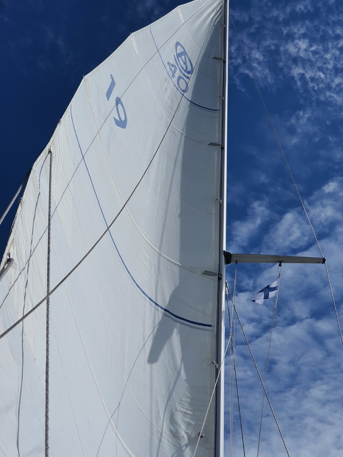

For logistical reasons we'll need to be in a marina tomorrow. Here the nature harbours are all clustered, so this meant we didn't have a long way to go today. But the weather was too nice to just sit in anchor. So we did a bit of an archipelago roundtrip.

 

Quite a lot of sailboats were out, mostly locals returning to Turku for the work week. We timed our sail so that we didn't have to dodge any big traffic on the Turku fairway.

 

As bigger gusts were in the forecast for the evening, we pulled ourselves into the protected bay of Väärämaa just off the fairway. Here we're swinging at regular bow anchor as the shores are too shallow for Scandic mooring. Nice dinner, some wine, and books.

* Distance today: 20.9NM
* Total distance: 780.7NM
* Lunch: spaghetti carbonara
